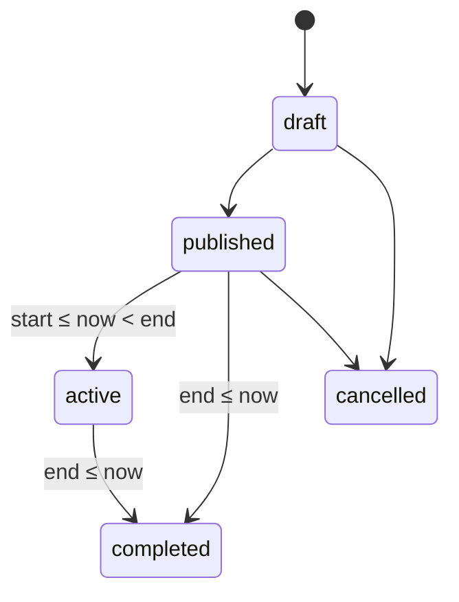

# Methodology

How Eventra's key mechanisms work: how tickets are signed and checked, how capacity and the waitlist avoid overselling, how events move through their lifecycle, how recommendations are produced, how a user's venue location is predicted, how XP and levels are computed, how feedback is scored and how requests are rate limited.

This document describes what the code does today, including places where behaviour differs from what a name or comment suggests.

[← Back to README](./README.md)

## Contents

1. [Overview](#1-overview)
2. [Ticket signing and check-in](#2-ticket-signing-and-check-in)
3. [Capacity control and the waitlist](#3-capacity-control-and-the-waitlist)
4. [Event lifecycle](#4-event-lifecycle)
5. [Pricing, promo codes and payouts](#5-pricing-promo-codes-and-payouts)
6. [Recommendations and matchmaking](#6-recommendations-and-matchmaking)
7. [Hybrid GPS and AI location prediction](#7-hybrid-gps-and-ai-location-prediction)
8. [Venue map pathfinding](#8-venue-map-pathfinding)
9. [XP, levels and badges](#9-xp-levels-and-badges)
10. [Feedback and NPS](#10-feedback-and-nps)
11. [Rate limiting](#11-rate-limiting)
12. [Known limitations](#12-known-limitations)

---

## 1. Overview

| Mechanism | Where | Technique |
| :--- | :--- | :--- |
| Ticket QR codes | `src/core/utils/crypto.ts` | HMAC-SHA256, constant-time compare |
| Capacity | `src/app/actions/registrations.ts` | Atomic conditional `UPDATE` |
| Waitlist | `src/app/actions/registrations.ts` | First in, first out, 24-hour reservation |
| Lifecycle | `src/app/actions/event-lifecycle.ts` | Time-based status transitions |
| Discounts and fees | `src/core/utils/promo-codes.ts`, `payouts.ts` | Clamped arithmetic, cent rounding |
| Recommendations | `src/app/actions/ai-recommendations.ts`, `matchmaking.ts` | pgvector cosine distance, then an LLM re-rank |
| Location | `src/lib/hybrid-prediction.ts`, `gps-utils.ts` | Weighted GPS plus AI score |
| Map routes | `src/features/map/pathfinding.ts` | Breadth-first search |
| Gamification | `src/lib/gamification/awards.ts` | Square-root level curve |
| Feedback | `src/core/utils/nps-analytics.ts` | Net Promoter Score |
| Rate limits | `src/lib/rate-limit.ts` | Fixed-window counters in the database |

## 2. Ticket signing and check-in

Each ticket has a ticket number such as `TKT-AB12CD34`. The QR code encodes the number and a signature:

$$\text{payload} = \text{ticketNumber} \,\Vert\, \texttt{:} \,\Vert\, \text{sig},\qquad \text{sig} = \text{hex}\bigl(\text{HMAC-SHA256}(K, \text{ticketNumber})\bigr)[0..16)$$

where $K$ is the server's `QR_SECRET`. The signature is truncated to the first 16 hex characters, which is 64 bits. Verification recomputes the signature and compares it with `crypto.timingSafeEqual`, which avoids leaking information through timing.

Without $K$, forging a signature for a chosen ticket number would take about $2^{64}$ guesses, which is not feasible online. In production the app refuses to run without `QR_SECRET`. In development it falls back to a fixed placeholder, so never run a public deployment without the variable set.

**Entry codes.** Each ticket also gets a 6-digit code from `crypto.randomInt(100000, 1000000)`, which gives 900,000 possible values. A guess against an event with $N$ valid tickets succeeds with probability about $N/900{,}000$. For 500 tickets that is about 0.056% per guess, or an expected 1,800 guesses to hit one. The check-in endpoints limit staff to 30 to 60 attempts per minute (§11).

**Check-in flow.** A scan first tries to parse a signed QR payload. If the signature is valid, the ticket is looked up by number. Otherwise the input is treated as an entry code and looked up with the event ID. Check-in sets the ticket status to `checked-in`, and a second scan of the same ticket is rejected.

**Offline mode.** The offline verifier checks a scan against a roster cached on the device. It matches the ticket number or entry code, and **it does not check the HMAC signature**, since it extracts the ticket number from the payload and ignores the rest. This keeps offline check-in simple, but it means offline mode accepts any bare ticket number or code that appears on the roster. Results are queued locally and synced when connectivity returns.

**Ticket expiry.** A ticket expires 24 hours after the event's end date.

## 3. Capacity control and the waitlist

Selling the last seat to two people at once is a classic race. Checking capacity first and then incrementing leaves a window where two requests both pass the check. Eventra closes it by putting the guard inside the same statement that increments:

```sql
UPDATE events
SET registered_count = registered_count + 1
WHERE id = $1
  AND (capacity = -1 OR registered_count < capacity)
RETURNING *;
```

If no row is returned the event is full and the surrounding transaction is rolled back. A capacity of `-1` means unlimited. Ticket tiers use the same pattern, and the payment webhook applies it to both event and tier.

**Waitlist.** When an event or tier is full and the waitlist is enabled, the person joins the waitlist with a position number. When a spot frees up (a ticket cancellation or an expired reservation):

1. The next entry by `position` with status `waiting` is chosen (first in, first out).
2. Its status becomes `reserved` with an expiry 24 hours ahead, and the person is notified with a link to claim the spot.
3. If they do not claim it in time, the entry is marked expired and the next person is promoted.

**Caveat.** A reservation does not actually hold a seat. The count is only incremented when the person claims, and that claim step increments `registered_count` **without** the capacity guard shown above. If a regular registrant takes the freed seat during the 24 hours, the claim still succeeds and the event ends up over capacity. The atomic guard protects normal registration, free registration and the payment webhook, but not the waitlist claim.

## 4. Event lifecycle

A job moves events through their statuses based only on the clock. It is exposed as `GET` or `POST /api/cron/lifecycle` and must be called by an external scheduler.



Each run:

1. Activates published events whose start has passed and whose end has not.
2. Completes active or published events whose end has passed, and sends post-event feedback emails.
3. Releases expired waitlist reservations.

The job only performs the two time-based transitions above. Moving an event out of `draft` or into `cancelled` is a manual action by the organizer. There is no `archived` status in the code. The cron endpoint requires `CRON_SECRET` in production and returns `500` if it is unset.

## 5. Pricing, promo codes and payouts

**Tier pricing.** A paid checkout is priced from the selected ticket tier. The expected amount is passed through payment metadata, and the webhook compares it with the amount actually settled. A mismatch is logged and not rejected.

**Promo discounts** take a type, a value and the order amount:

$$d = \begin{cases} A \cdot \min\bigl(100, \max(0, v)\bigr)/100 & \text{percentage} \\ \max(0, v) & \text{fixed} \end{cases},\qquad d^{*} = \min(A, \max(0, d)),\qquad \text{final} = A - d^{*}$$

with results rounded to cents. For example, 20% off a 50.00 order gives a discount of 10.00 and a final price of 40.00, and a fixed 60.00 discount on 50.00 gives a discount of 50.00 and a final price of 0.00. The discount can never exceed the order.

Redemption is counted with a conditional `UPDATE` that increments `used_count` only while it is below `max_uses`, the code is active and it has not expired.

**Platform fee and payouts.** The platform keeps 5% of gross sales, rounded to cents, and the minimum payout is 100:

$$\text{fee} = \frac{\mathrm{round}(100 \cdot g \cdot 0.05)}{100},\qquad \text{net} = \max(0,\ g - \text{fee})$$

For a gross of 1,234.56 the fee is 61.73 and the net is 1,172.83.

## 6. Recommendations and matchmaking

**Embeddings.** Text is turned into a 768-dimension vector with Google's `text-embedding-004`:

| Entity | Text embedded | When |
| :--- | :--- | :--- |
| User | name, interests and bio | Once, when the user has none yet |
| Event | title, category and description | When an event is created or edited |

**Similarity.** PostgreSQL's pgvector computes cosine distance with the `<=>` operator. The similarity is $1 - \text{distance}$:

$$\text{sim}(\mathbf{a}, \mathbf{b}) = \frac{\mathbf{a}\cdot\mathbf{b}}{\lVert\mathbf{a}\rVert\,\lVert\mathbf{b}\rVert} = 1 - d_{\cos}(\mathbf{a}, \mathbf{b})$$

**Event recommendations.** The 15 published events nearest to the user's embedding are selected, excluding events the user already has a ticket for. The user's interests, enriched with the categories of past registrations, and those 15 candidates go to a Gemini flow, which writes the final recommendations and the reasons for them.

**People matchmaking.** The 10 users whose embeddings are nearest to the current user's are selected. A Gemini flow then ranks them and explains why.

**Fallbacks.** If the user has no embedding, event recommendations use the first 15 non-cancelled events and matchmaking uses 10 other users, in database order and not ranked by relevance.

The LLM step sees only the shortlist, and the shortlist comes from vector similarity, not from the model. Genkit validates the model's output against a schema, but nothing checks that its reasons are accurate.

## 7. Hybrid GPS and AI location prediction

To suggest which campus location a user is at, Eventra combines a GPS reading with an AI guess.

**GPS score.** The distance to each known location uses the Haversine formula with $R = 6{,}371{,}000$ m:

$$a = \sin^2\!\left(\tfrac{\Delta\phi}{2}\right) + \cos\phi_1\cos\phi_2\sin^2\!\left(\tfrac{\Delta\lambda}{2}\right),\qquad d = 2R\,\mathrm{atan2}\bigl(\sqrt{a}, \sqrt{1-a}\bigr)$$

The GPS confidence falls off linearly with distance and is 0 beyond 500 m, and the nearest location counts as a match only if it is within 500 m:

$$c_{\text{gps}} = \max\!\left(0,\ 1 - \frac{d}{500}\right)$$

**Combination.** With only one source, that source's confidence is used. With both, the weights are 0.4 for GPS and 0.6 for AI:

$$s = 0.4\,c_{\text{gps}} + 0.6\,c_{\text{ai}}$$

If both point to the same location, an agreement boost is added, capped at 0.2:

$$\text{boost} = \min(0.2,\ 0.2\,s),\qquad c_{\text{final}} = \min(1,\ s + \text{boost})$$

For example, a GPS fix 100 m away gives $c_{\text{gps}} = 0.8$. With an AI confidence of 0.9 for the same place, $s = 0.32 + 0.54 = 0.86$, the boost is $0.172$ and the final confidence is capped at 1.0. The reported contributions are 37% GPS and 63% AI. If the AI response has no confidence value, 0.8 is assumed.

The three best suggestions are the GPS-nearest locations plus the AI's pick, ranked by combined score.

**Behaviour to be aware of.** When both sources exist but disagree, the code chooses the final location with `combinedScore >= gpsScore ? ai : gps`. The combined score is the GPS part plus a non-negative AI part, so it is never lower than the GPS part, and the AI's location wins every time. In practice the weights affect the confidence number but not which location is chosen.

## 8. Venue map pathfinding

An organizer's custom map is a graph. Nodes have percentage coordinates (0 to 100) on the uploaded image and edges are walkable connections, treated as two-way. Routes are found with **breadth-first search**, which finds the path with the **fewest nodes**, not the shortest distance, because edges are not weighted.

Each step gets an instruction from the direction to the next node:

- If $|\Delta x| > |\Delta y|$, it is "Head right" ($\Delta x > 0$) or "Head left".
- Otherwise it is "Head down" ($\Delta y > 0$) or "Head up".
- The first step is "Start here" and the last is "You have arrived".

The distance shown per step is $\sqrt{(10\,\Delta x)^2 + (10\,\Delta y)^2}$, rounded. These are image-space units, not metres, because maps have no real scale. If no path exists, the result is empty.

## 9. XP, levels and badges

Actions award fixed XP:

| Action | XP |
| :--- | :---: |
| Create an event | 100 |
| Register for an event | 100 |
| Be checked in at an event | 50 |
| Create a community | 50 |
| Post in a community | 20 |
| Join a community, or join a challenge | 10 |
| Comment on a post | 5 |
| Like a post | 2 |

The level follows a square-root curve, so each level takes more XP than the last:

$$\text{level} = \left\lfloor \sqrt{\frac{\text{XP}}{100}} \right\rfloor + 1 \quad\Longleftrightarrow\quad \text{XP to reach level } L = 100\,(L-1)^2$$

| Level | 1 | 2 | 3 | 4 | 5 | 10 |
| :--- | :---: | :---: | :---: | :---: | :---: | :---: |
| XP needed | 0 | 100 | 400 | 900 | 1,600 | 8,100 |

Each XP award also adds the same amount to `points`. A notification is created for the gain, and another one on a level-up.

**Badges** have criteria stored in the database. The supported types are level reached, points reached, account created, number of registrations, number of events attended (checked-in tickets) and number of posts. Eligible badges are awarded once each.

## 10. Feedback and NPS

Post-event surveys include a 0 to 10 recommendation question. The Net Promoter Score groups answers and subtracts:

| Group | Score |
| :--- | :---: |
| Promoters | 9 to 10 |
| Passives | 7 to 8 |
| Detractors | 0 to 6 |

$$\text{NPS} = \mathrm{round}(\%\text{promoters}) - \mathrm{round}(\%\text{detractors})$$

The result ranges from −100 to +100. For 10 answers with 5 promoters, 3 passives and 2 detractors, NPS is $50 - 20 = 30$. Each percentage is rounded before subtracting. The status label follows fixed bands:

| NPS | Label |
| :--- | :--- |
| 70 or more | World Class |
| 50 to 69 | Excellent |
| 0 to 49 | Good |
| −30 to −1 | Needs Improvement |
| below −30 | Critical |

With no valid answers the score is 0 and the label is "Good". Rating averages (overall, venue, content and organization) and the 1 to 5 rating distribution are computed alongside it.

## 11. Rate limiting

Rate limits are counters stored in the `rate_limits` table, so they are shared across servers. A request increments the counter for its identifier, scope and time window with a single upsert, and is refused when the count exceeds the limit.

- **Identifier:** the user ID plus the client IP (`x-forwarded-for`, then `x-real-ip`) when signed in, or the IP alone.
- **Window:** fixed 60-second windows aligned to the clock.
- **Defaults and examples:** 120 requests per window by default, 5 registrations, 30 ticket verifications, 60 check-ins and 10 URL imports.

A fixed window can let a burst of up to twice the limit through around a window boundary, and a client that can spoof `x-forwarded-for` can dodge IP-based limits, so deploy behind a proxy that sets it reliably.

## 12. Known limitations

- **Offline check-in skips signature checks** (§2).
- **Entry codes are 6 digits** (§2). The audit left this as a usability trade-off.
- **Ticket numbers are not secret.** They use `Math.random`, and security rests on the HMAC, not on the number being hard to guess.
- **The lifecycle job needs a scheduler** (§4), and there is no archive step.
- **Paid checkout and promo discounts are not wired into the UI.** The server logic and the maths in §5 are tested, but no page calls them (see the README's project status).
- **Recommendation caching is not active.** The cache table, key builder and freshness check exist, but nothing reads or writes the cache, so every call re-runs the vector query and the LLM.
- **No vector index.** The schema defines no HNSW or IVFFlat index, so nearest-neighbour queries scan every row. This is fine for small data and slow at scale.
- **Embeddings can go stale.** A user's embedding is created once and not refreshed when their bio or interests change.
- **The hybrid location logic always prefers the AI location** when the sources disagree (§7).
- **BFS ignores distance** and map distances have no real units (§8).
- **Waitlist claims can exceed capacity** (§3).
- **XP awards are read-modify-write** and not atomic, so two simultaneous awards could lose one update.
- **No offline evaluation.** The weights, thresholds and point values are reasonable starting values and are not tuned against data.
