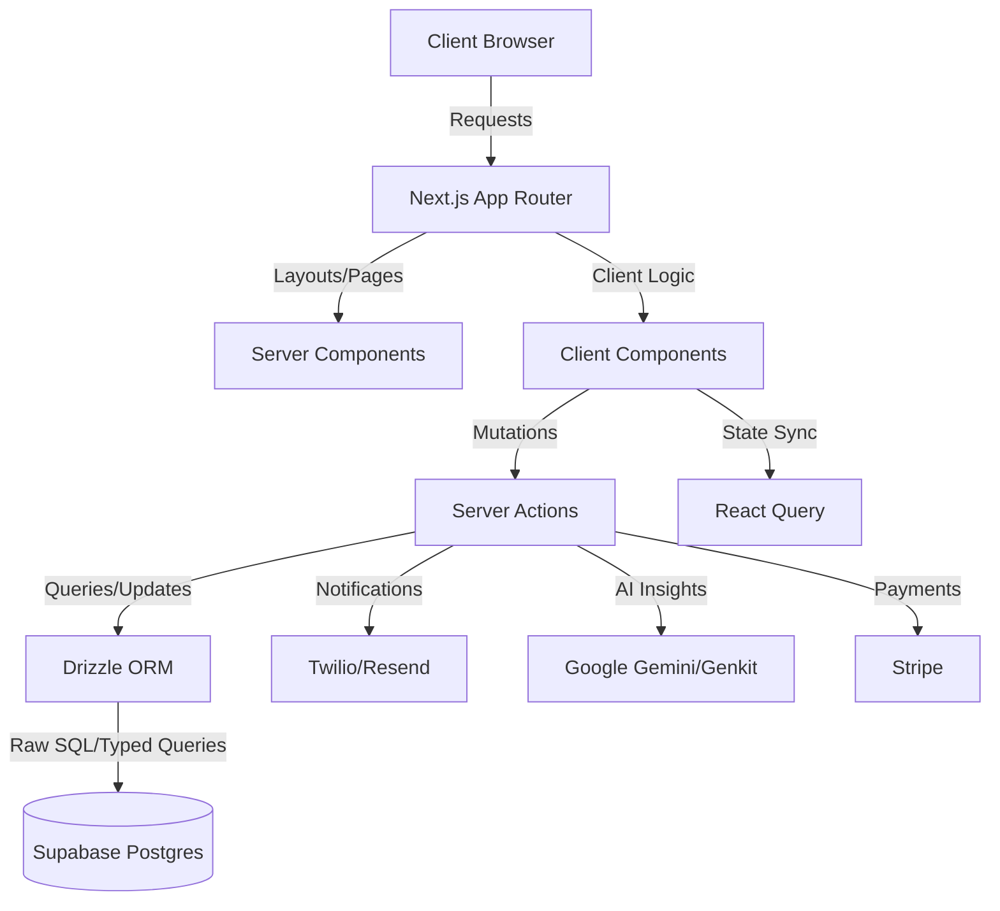
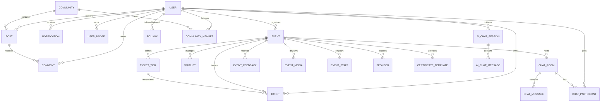

# Eventra — The Ultimate Event Ecosystem


Eventra is a next-generation event management platform built for the modern web. It provides a seamless, end-to-end ecosystem for organizers to publish events, manage ticketing, foster communities, and leverage AI-driven insights, while offering attendees a polished discovery and engagement experience.

---

## 🚀 Vision & Key Features

Eventra bridges the gap between static event listing and interactive community engagement.

### **For Attendees**
- **Intuitive Discovery**: Explore events via an aurora-themed landing page with category-based filtering.
- **Unified Wallet**: Access and manage all event tickets and QR codes in a single digital vault.
- **Social Integration**: Participate in community discussion boards, real-time chats, and activity feeds.
- **Gamification**: Earn XP, level up, and unlock distinctive badges for event participation.
- **AI Personalization**: Receive tailored event recommendations based on interests and behavior.

### **For Organizers**
- **Event Wizard**: Create complex physical, virtual, or hybrid events with ease.
- **Advanced Management**: Manage ticket tiers, waitlists, and bulk certificate distribution.
- **Engagement Tools**: Publish announcements, run live polls, and moderate community media.
- **Rich Analytics**: Deep-dive into revenue trends, attendee demographics, and sentiment analysis.
- **AI Copilot**: Generate marketing copy, predict attendance, and get smart scheduling suggestions.

### **For Administrators**
- **Global Governance**: Moderate users and events across the entire platform.
- **System Control**: Toggle platform-wide features (Chat, Feed, AI) from a central command center.
- **Platform Analytics**: Monitor total registration growth and platform health metrics.

---

## 🛠️ Tech Stack

Eventra is built using a "Clean Architecture" approach, prioritizing modularity and type safety.

- **Framework**: [Next.js 15](https://nextjs.org/) (App Router, Server Actions)
- **Language**: [TypeScript 5](https://www.typescriptlang.org/)
- **Database**: [PostgreSQL](https://www.postgresql.org/) (Supabase)
- **ORM**: [Drizzle ORM](https://orm.drizzle.team/)
- **Styling**: [Tailwind CSS](https://tailwindcss.com/) + [Radix UI](https://www.radix-ui.com/)
- **State Management**: [TanStack React Query](https://tanstack.com/query/latest)
- **i18n**: [next-intl](https://next-intl-docs.vercel.app/) (Multi-language support)
- **AI Interface**: [Google Generative AI](https://ai.google.dev/) (via Genkit)
- **Payments & Communication**: [Stripe](https://stripe.com/), [Twilio](https://www.twilio.com/), [Resend](https://resend.com/)

---

## 🏗️ System Architecture

Eventra follows a modular **Feature-First Architecture**, where each of the 25+ modules (e.g., `events`, `ticketing`, `chat`) encapsulates its own logic, components, and data fetching.



---

## 📊 Database Schema (ERD)

The database is built for scale, supporting vector embeddings for AI recommendations and complex many-to-many relationships for community and networking features.



---

## 🎨 Design System

Eventra utilizes a tokenized UI system built with **HSL semantic tokens**, allowing for seamless light/dark mode transitions and consistent brand identity.


| Token | Dark Mode HSL | Light Mode HSL |
| :--- | :--- | :--- |
| **Background** | `222 47% 6%` | `220 30% 98%` |
| **Card** | `222 40% 9%` | `0 0% 100%` |
| **Primary** | `262 83% 66%` | `262 83% 58%` |
| **Accent** | `188 86% 53%` | `188 86% 45%` |

---

## 🚦 Getting Started

### **1. Clone & Install**
```bash
git clone <repository-url>
cd Eventra/eventra-webapp
npm install
```

### **2. Environment Setup**
Create a `.env.local` file from the provided template:
```bash
cp .env.example .env.local
```
*Note: Ensure your `DATABASE_URL` (Supabase) and integration keys (Stripe, Twilio, etc.) are correctly configured.*

### **3. Database Migration**
Push the schema to your Supabase instance:
```bash
npm run db:push
```

### **4. Launch Development Server**
```bash
npm run dev
```
The application will be accessible at [http://localhost:9002](http://localhost:9002).

---

## 📜 Essential Scripts

| Script | Description |
| :--- | :--- |
| `npm run build` | Compiles the production application. |
| `npm run typecheck` | Validates TypeScript integrity across the codebase. |
| `npm run lint` | Runs ESLint for code style enforcement. |
| `npm run test:smoke` | Seeds the database and runs E2E sanity checks. |
| `npm run db:studio` | Opens the Drizzle interactive database explorer. |

---

## 🚧 Status & Roadmap

Eventra recently completed a **Forced Stabilization Phase**, where core authentication and payment systems were removed to ensure a clean, high-performance build.

### **Current Focus (Phase 1)**
- [ ] **Auth Restoration**: Re-integrating Auth.js (v5) with corrected OAuth callback logic.
- [ ] **Security Patching**: Fixing the stubbed server-side RBAC validation utility.
- [ ] **Global ID Standard**: Refactoring legacy `_id` references to standardized `id`.

### **Future Horizon (Phase 2 & 3)**
- [ ] Re-integration of Stripe for paid event ticketing.
- [ ] Comprehensive i18n coverage for Spanish/English across all features.
- [ ] Deployment of the AI Marketing Copilot for event organizers.

---

## 📄 License
This project is currently private. See individual files for licensing restrictions where applicable.
