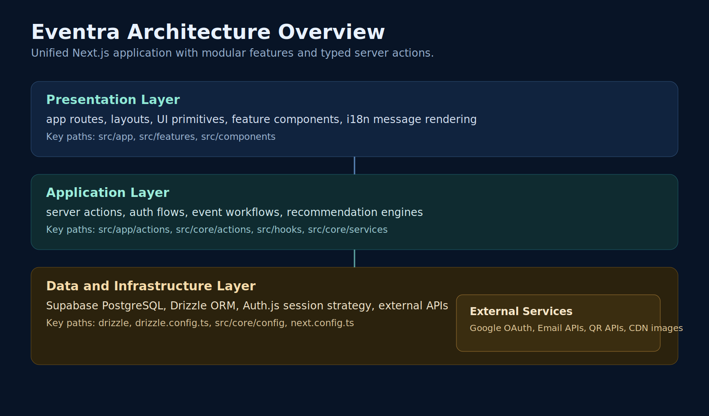
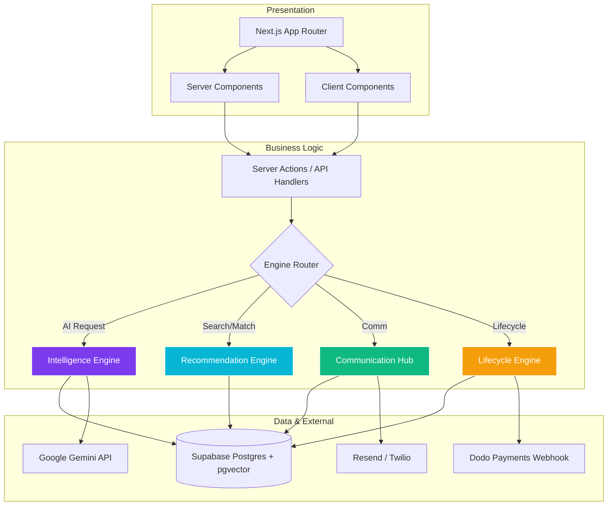
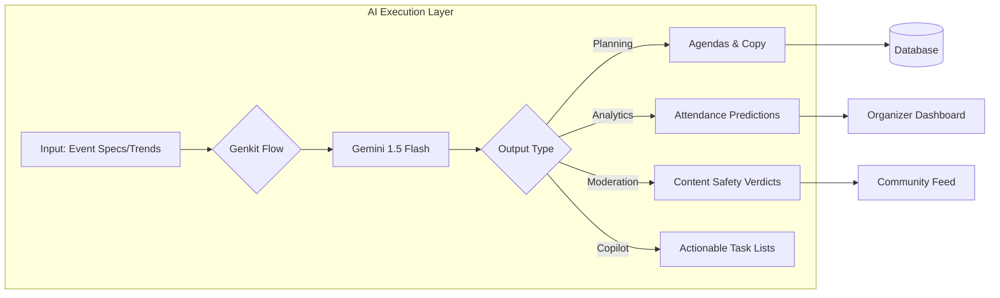
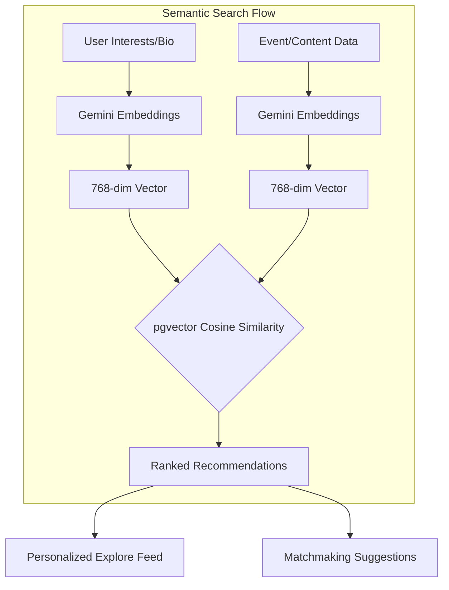
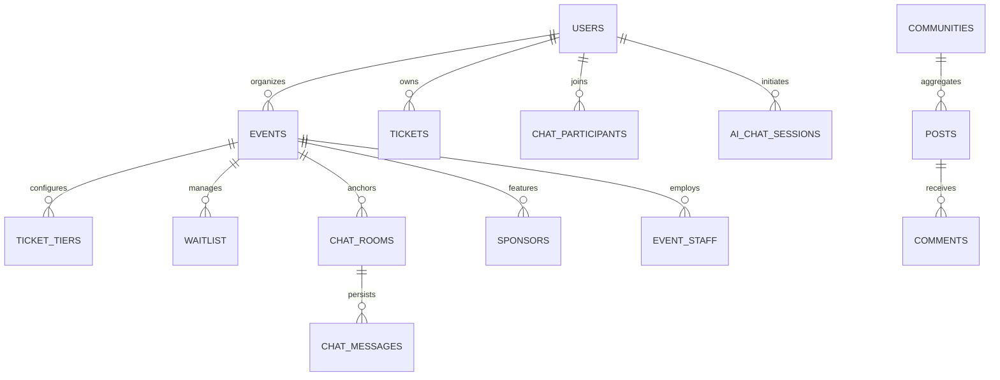

# Eventra — The Intelligent Event Management Ecosystem

[](https://nextjs.org/)
[](https://www.typescriptlang.org/)
[](https://orm.drizzle.team/)
[](https://vitest.dev/)
[](https://github.com/)
[](https://www.docker.com/)


Eventra is a premium, enterprise-grade event management platform designed to automate the full lifecycle of complex events. Built with **Next.js 15**, **PostgreSQL**, **Drizzle ORM**, and **Google Gemini AI**, Eventra transforms passive event hosting into an active, data-driven, and community-centric experience.

---

## 🏗️ Master System Architecture

Eventra follows a **Feature-First modular architecture**, where AI modules and Vector databases are deeply integrated into the core mutation flows.





---

## 🚀 Core Technology Pillars

### 1. **The Intelligence Engine (AI & Genkit)**
Powered by **Google Gemini 1.5 Flash** and **Genkit**, our AI layer provides real-time automation and deep insights.
*   **Smart Event Planning**: Generates detailed descriptions, agendas, and marketing copy.
*   **Predictive Analytics**: Estimates attendee turnout based on registration trends.
*   **Automated Moderation**: Real-time sentiment analysis and content filtering.
*   **Copilot for Organizers**: Generates actionable "To-Do" lists and smart scheduling suggestions.



### 2. **The Vector-Powered Recommendation Engine**
Eventra uses **pgvector** and semantic search to connect users with high-value content.
*   **Semantic Matching**: Uses 768-dimensional vector embeddings to match user interests.
*   **Connection Matchmaking**: Suggests networking based on professional goals.
*   **Hyper-Personalization**: Delivers curated "Engagement Picks" that evolve with the user.



### 3. **The Real-Time Communication Hub**
A scalable chat and notification infrastructure built for high concurrency.
*   **Contextual Channels**: Automatic event-specific chat rooms.
*   **Direct & Group Messaging**: Private and professional networking.
*   **Intelligent Notifications**: Multi-channel delivery (SMS via Twilio, Email via Resend).

### 4. **The Event Lifecycle Engine**
The core structural layer managing the complexities of modern events.
*   **Dynamic Ticketing**: Multi-tier pricing, waitlists, and QR fulfillment.
*   **Recurring Instances**: Advanced RRule-based scheduling.
*   **Credential Management**: Automated PDF generation with client-side DOMPurify sanitization.

---

## 📊 Database Architecture (ERD)

The database handles relational, vector, and hierarchical data types. Clerk user roles are dynamically mapped to database user profiles.



---

## 🔑 Production Environment Configuration

Create a `.env.local` or `.env` file in the root directory. The following variables must be configured before launching in production:

```env
# Database & ORM
DATABASE_URL=postgresql://<user>:<password>@<host>:6543/postgres?sslmode=require

# Authentication (Clerk)
NEXT_PUBLIC_CLERK_PUBLISHABLE_KEY=pk_live_...
CLERK_SECRET_KEY=sk_live_...

# Payment Gateway (Dodo Payments)
DODO_PAYMENTS_API_KEY=dp_...
DODO_PAYMENTS_WEBHOOK_SECRET=whsec_...

# Security & Cryptography
JWT_SECRET=eventra-jwt-signing-secret-change-in-production
QR_SECRET=eventra-qr-signing-secret-change-in-production
SESSION_SECRET=eventra-session-signing-secret-change-in-production
ALLOWED_ORIGINS=https://yourdomain.com

# Integrations
GEMINI_API_KEY=AIzaSy...
SENDGRID_API_KEY=SG....
TWILIO_ACCOUNT_SID=AC...
TWILIO_AUTH_TOKEN=...
```

> [!IMPORTANT]
> - `QR_SECRET` and `JWT_SECRET` are strictly required in production mode. If missing or unset when `NODE_ENV=production`, the application will abort initialization to prevent fallback security exploits.
> - Webhook endpoints check signature verification using `DODO_PAYMENTS_WEBHOOK_SECRET`. Ensure this is identical to your Dodo payments dashboard setting.

---

## 🛠️ Database Setup & Synchronization

We manage schema definitions with **Drizzle ORM**. Run the following commands to generate migration scripts and sync your database:

1. **Generate Migrations**:
   ```bash
   npm run db:generate
   ```
2. **Apply Migrations (Sync Remote DB)**:
   ```bash
   node scripts/sync-db.mjs
   ```
   *Note: `sync-db.mjs` automatically handles dropping obsolete NextAuth tables, adding missing `source_type` columns, and removing deprecated tracking variables in compliance with GDPR.*

---

## 🧪 Testing

We use **Vitest** for running unit and integration tests. 

```bash
# Run tests once (CI mode)
npm run test

# Run tests in watch mode
npm run test:watch
```

Tests cover critical flows, including:
*   Cryptographic QR signing consistency.
*   Timing-safe scan validation (`crypto.timingSafeEqual`).
*   Entry code generation.

---

## 🐳 Docker Deployment

The application features a production-grade multi-stage `Dockerfile` optimized for container size.

1. **Build Container**:
   ```bash
   docker build -t eventra-app .
   ```
2. **Run Container**:
   ```bash
   docker run -p 9002:9002 --env-file .env.local eventra-app
   ```

---

## 📄 License

Copyright © 2026 **Eventra Ecosystem**. All rights reserved.

This project and its accompanying documentation are the proprietary and confidential property of **Eventra**. Any unauthorized use, reproduction, or distribution of this software, in whole or in part, without the prior written consent of the copyright holder is strictly prohibited.
