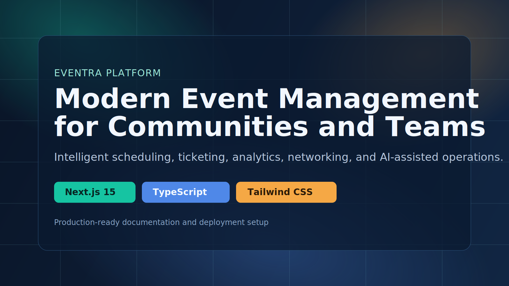
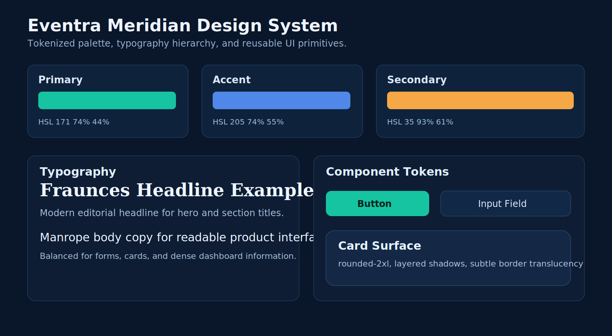

# Eventra



Eventra is a modern event management platform built with Next.js 15, TypeScript, and a modular feature-first architecture. It supports event publishing, ticketing workflows, community engagement, analytics, notifications, and AI-assisted recommendations.

## Table of Contents
1. Project Overview
2. Key Features
3. Architecture
4. Tech Stack
5. Repository Structure
6. Getting Started
7. Environment Variables
8. Database and Migrations
9. Scripts
10. Quality Gates
11. Deployment
12. Security Notes
13. Roadmap Snapshot

## Project Overview
Eventra is designed for organizations, campuses, and teams that need one platform to manage the full event lifecycle.

Core goals:
- Deliver fast and reliable event operations.
- Provide role-aware user experiences for attendees, organizers, and admins.
- Keep business logic modular and maintainable through feature boundaries.
- Enable global readiness with internationalization support.

## Key Features
- Event discovery, details, and organizer workflows.
- Ticketing and registration flow foundations.
- Check-in and scanner modules.
- Community spaces and social interactions.
- Notifications and engagement modules.
- Analytics dashboards and reporting surfaces.
- AI recommendation and event intelligence actions.
- Internationalization support (English and Spanish).

## Architecture


The project follows a unified Next.js architecture:
- Presentation layer: app routes, layouts, feature components, design system.
- Application layer: server actions, auth/session orchestration, business workflows.
- Data layer: Supabase PostgreSQL with Drizzle ORM and typed access patterns.

## Tech Stack
- Runtime: Node.js
- Framework: Next.js 15 (App Router)
- Language: TypeScript 5
- UI: Tailwind CSS, Radix UI, class-variance-authority
- State and data fetching: TanStack React Query
- Access model: Public guest-only platform (no login required)
- i18n: next-intl
- Charts: Recharts
- Database: PostgreSQL (Supabase) + Drizzle ORM

## Repository Structure
```text
Eventra/
  backend/                     # Reserved for backend services (currently empty)
  frontend/                    # Main production app
    public/
      readme/                  # Documentation images
    src/
      app/                     # Next.js routes, layouts, server actions
      components/              # Shared UI, layout, and provider components
      core/                    # Shared services, config, utilities, auth
      features/                # Feature modules (events, chat, analytics, etc.)
      hooks/                   # Shared hooks
      lib/                     # Library-level helpers
      types/                   # Shared TypeScript types
```

## Getting Started
### Prerequisites
- Node.js 20+ (LTS recommended)
- npm 10+
- PostgreSQL connection (Supabase URL or equivalent)

### Installation
```bash
cd frontend
npm install
```

### Local Development
```bash
npm run dev
```
Default local URL:
- http://localhost:9002

### Production Build
```bash
npm run build
npm run start
```

## Environment Variables
Create a local environment file from the template:
```bash
cd frontend
cp .env.example .env
```

Variable reference:

| Variable | Scope | Required | Description |
|---|---|---|---|
| NEXT_PUBLIC_SUPABASE_URL | Client | Yes | Supabase project URL used by browser-facing requests. |
| NEXT_PUBLIC_SUPABASE_ANON_KEY | Client | Yes | Public Supabase anonymous key for client operations. |
| DATABASE_URL | Server | Yes | PostgreSQL connection string for server actions and Drizzle. |
| RESEND_API_KEY | Server | No | Enables transactional email API routes. |
| TWILIO_ACCOUNT_SID | Server | No | Enables Twilio SMS notifications. |
| TWILIO_AUTH_TOKEN | Server | No | Auth token paired with Twilio SID. |
| TWILIO_FROM_NUMBER | Server | No | Sender number for SMS notifications. |
| GOOGLE_API_KEY | Server | No | Enables AI provider access for recommendation/chat flows. |
| IMAGE_UPLOAD_SIZE | Server | No | Application image upload size setting (default: 520). |

Validation command:
```bash
cd eventra-webapp
npm run env:check
```

## Database and Migrations
Eventra uses Drizzle for schema and migration workflows.

Common commands:
```bash
cd frontend
npm run db:generate
npm run db:push
npm run db:studio
```

## Scripts
All commands below are executed from the frontend directory:

| Command | Category | Purpose |
|---|---|---|
| npm run dev | Development | Start the Next.js development server on port 9002. |
| npm run build | Build | Create an optimized production build. |
| npm run start | Build | Run the production server from the generated build output. |
| npm run lint | Quality | Run ESLint checks using the Next.js configuration. |
| npm run typecheck | Quality | Run TypeScript type checks without emitting files. |
| npm run db:generate | Database | Generate Drizzle migration files from schema changes. |
| npm run db:push | Database | Apply schema changes to the target database. |
| npm run db:studio | Database | Open Drizzle Studio for schema and data inspection. |

## Quality Gates
Recommended release checks before merge or deploy:
```bash
cd eventra-webapp
npm run env:check
npm run lint
npm run typecheck
npm run build
```

Production readiness standards:
- No build-time TypeScript errors.
- No unresolved imports.
- Environment variables configured per environment.
- Database schema changes reviewed before push.

## Deployment
Typical flow:
1. Configure environment variables in hosting platform.
2. Run lint, typecheck, and build in CI.
3. Run database migration workflow for target environment.
4. Deploy frontend artifact.
5. Run post-deploy smoke tests on critical user journeys.

Suggested smoke test set:
- Event listing and details
- Ticketing flow entry and completion path
- Check-in scanner route load
- Notifications route load

## Security Notes
- Never commit real secrets to source control.
- Rotate compromised credentials immediately.
- Restrict database users and permissions by environment.
- Enforce HTTPS and secure cookie policies in production.

## Design System Preview


Current theme direction:
- Deep navy surfaces with teal and amber accents.
- Editorial headings and high-readability body typography.
- Tokenized component styling for consistent spacing, radius, and elevation.

## Roadmap Snapshot
In-progress focus areas:
- Complete server-side validation and error-envelope consistency for write operations.
- Finalize end-to-end ticketing and check-in integrity.
- Expand automated testing (unit, integration, E2E).
- Harden CI/CD and release rollback procedures.

## License
No license file is currently defined in this repository. Add a LICENSE file if this project is intended for open distribution.
