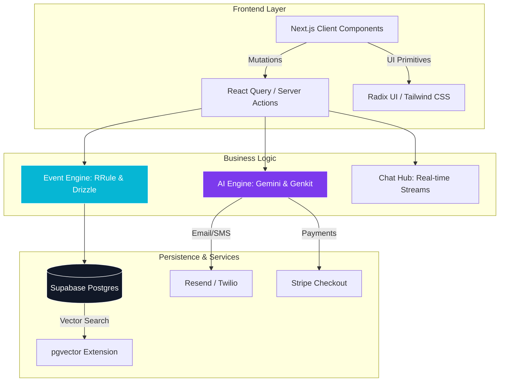
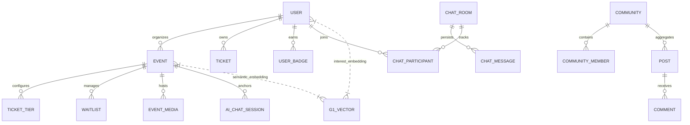

# Eventra — The Intelligent Event Management Ecosystem


Eventra is a premium, enterprise-grade event management platform designed to automate the full lifecycle of complex events. Built with **Next.js 15**, **PostgreSQL**, and **Google Gemini AI**, Eventra transforms passive event hosting into an active, data-driven, and community-centric experience.

---

## 🚀 Core Technology Pillars

Eventra is powered by four specialized engines that work in concert to deliver a seamless experience for attendees, organizers, and platform administrators.

### 1. **The Intelligence Engine (AI & Genkit)**
Powered by **Google Gemini 1.5 Flash** and **Genkit**, our AI layer provides real-time automation and deep insights.
- **Smart Event Planning**: Generates detailed descriptions, agendas, and SEO-optimized marketing copy from minimal inputs.
- **Predictive Analytics**: Estimates attendee turnout based on registration trends and historical data.
- **Automated Moderation**: Real-time sentiment analysis and content filtering for community feeds and media.
- **Copilot for Organizers**: Generates actionable "To-Do" lists and smart scheduling suggestions (best days/times) based on category and audience.

### 2. **The Vector-Powered Recommendation Engine**
Eventra uses **pgvector** and semantic search to connect users with high-value content and connections.
- **Semantic Matching**: Uses 768-dimensional vector embeddings to match user interests with event topics.
- **Connection Matchmaking**: Suggests networking opportunities by identifying shared professional goals and skills.
- **Hyper-Personalization**: Delivers curated "Engagement Picks" that evolve as the user interacts with the platform.

### 3. **The Real-Time Communication Hub**
A scalable chat and notification infrastructure built for high concurrency.
- **Contextual Channels**: Automatic creation of event-specific chat rooms for attendees and staff.
- **Direct & Group Messaging**: Full support for professional networking and private collaboration.
- **Intelligent Notifications**: Multi-channel delivery (SMS via Twilio, Email via Resend) triggered by event milestones and AI alerts.

### 4. **The Event Lifecycle Engine**
The core structural layer managing the complexities of modern events.
- **Dynamic Ticketing**: Multi-tier pricing, automated waitlists, and instant QR-based fulfillment.
- **Recurring Instances**: Advanced RRule-based scheduling for series-based workshops or conferences.
- **Credential Management**: Automated PDF certificate generation with AI-personalized congratulatory messages.

---

## 🏗️ System Architecture

Eventra follows a **Feature-First modular architecture**, ensuring that every domain (Auth, AI, Payments, Chat) is isolated, testable, and scalable.



---

## 📊 High-Scale Database Architecture

Our schema is optimized for relational integrity and fast vector retrieval, supporting a complex graph of users, communities, and real-time events.



---

## 🎨 Design System & UI

Eventra features a bespoke design system built on **HSL semantic tokens**, providing a lush, high-contrast aesthetic that remains accessible and performant.


- **Typography**: Space Grotesk (Headlines) & Inter (Body).
- **Surface**: Deep Navy (`#06080F`) with Glassmorphism overlays.
- **Accents**: Cyber Cyan & Radiant Violet for high-signal CTAs.

---

## 🚦 Engineering Standards & Setup

### **1. Prerequisites**
- **Node.js**: v20+ (LTS)
- **Database**: PostgreSQL with `pgvector` extension.
- **AI**: Google Cloud project with Gemini API access.

### **2. Rapid Installation**
```bash
git clone <repository-url>
cd Eventra/eventra-webapp
npm install
cp .env.example .env.local
```

### **3. Local Deployment**
```bash
# Apply schema to database
npm run db:push

# Launch the engine
npm run dev
```
The platform will initialize at [http://localhost:9002](http://localhost:9002).

---

## 📜 Critical Workflows

| Script | Purpose |
| :--- | :--- |
| `npm run test:smoke` | Executes the E2E "Seed & Verify" chain for events, tickets, and AI flows. |
| `npm run build` | Generates the production-optimized Next.js bundle. |
| `npm run db:studio` | Provides a GUI for real-time database management via Drizzle. |
| `npm run typecheck` | Enforces total TypeScript coverage across all 25 modules. |

---

## 🚧 Roadmap: The Path to Production

Eventra has recently completed a **Forced Stabilization Phase**. Our immediate focus is on restoring the few systems simplified for the build release.

1. **Phase 1: Security Hardening**
   - [ ] Restore **Auth.js (v5)** with production-grade OAuth callbacks.
   - [ ] Repair the server-side RBAC validation utility (`src/lib/auth-utils.ts`).
   - [ ] Standardize 240+ error handlers to structured API envelopes.

2. **Phase 2: Commercial Re-integration**
   - [ ] Re-add **Stripe** for tiered ticketing and sponsor revenue.
   - [ ] Finalize the **AI Marketing Copilot** dashboard for event organizers.

3. **Phase 3: Global Scale**
   - [ ] Achieve 100% i18n coverage for Spanish and English locales.
   - [ ] Deploy the **Vector Similarity Cache** to optimize high-volume recommendations.

---

## 📄 License
This repository is currently private and confidential. Use without explicit permission is strictly prohibited.
