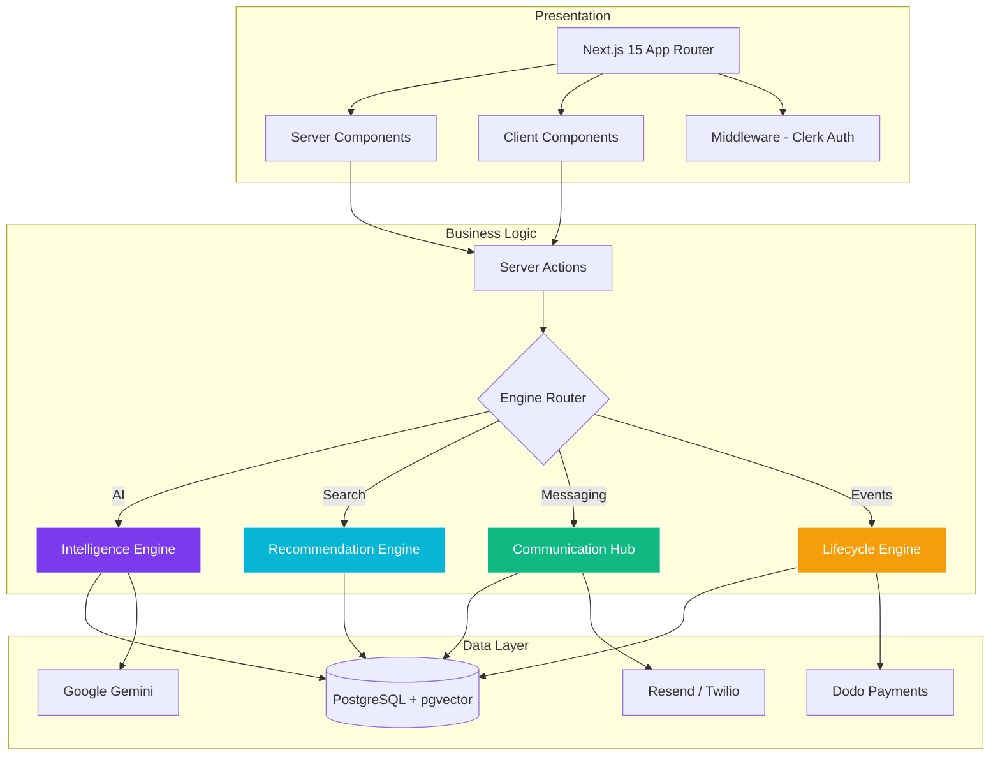
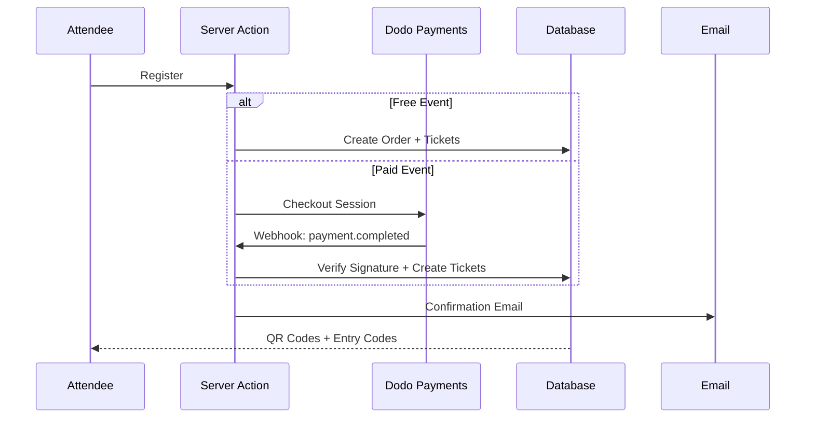
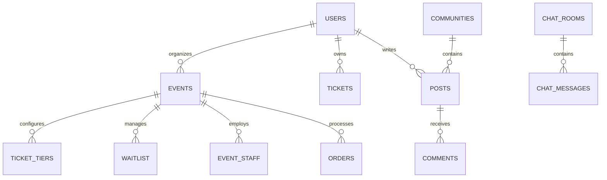

# Eventra -- Intelligent Event Management Platform

[](https://nextjs.org/)
[](https://www.typescriptlang.org/)
[](#license)

An enterprise-grade event management platform that automates the full lifecycle of complex events. Built with Next.js 15, PostgreSQL with pgvector, Drizzle ORM, Clerk authentication, and Google Gemini AI.

---

## Table of Contents

- [Architecture](#architecture)
- [Tech Stack](#tech-stack)
- [Project Structure](#project-structure)
- [Features](#features)
- [Database](#database)
- [API Routes](#api-routes)
- [Environment Variables](#environment-variables)
- [Setup](#setup)
- [Database Setup](#database-setup)
- [Testing](#testing)
- [Deployment](#deployment)
- [Security](#security)
- [License](#license)

---

## Architecture

Four integrated engines power the platform: Intelligence (AI), Recommendation (vector search), Communication (email/SMS/chat), and Lifecycle (events/ticketing/payments).



---

## Tech Stack

| Layer | Technology |
|-------|-----------|
| Framework | Next.js 15 (App Router, Server Actions) |
| Language | TypeScript 5 |
| Auth | Clerk 7 (OAuth, JWT, Webhooks) |
| Database | PostgreSQL 15 (Supabase) + pgvector |
| ORM | Drizzle ORM 0.45 |
| AI | Google Gemini 1.5 Flash + Genkit |
| Payments | Dodo Payments |
| Email | Resend |
| SMS | Twilio |
| UI | Shadcn/ui + Radix UI + Tailwind CSS |
| Charts | Recharts |
| Maps | Leaflet + React-Leaflet |
| PDF | jsPDF + html2canvas |
| Forms | React Hook Form + Zod |
| State | TanStack React Query |
| i18n | next-intl |

---

## Project Structure

```
src/
  app/
    (app)/           -- Authenticated routes (sidebar layout)
    (auth)/          -- Login, register, onboarding
    api/             -- 21 API route handlers
    actions/         -- 44 server action files
  features/          -- 25 feature modules
  components/        -- Shared Shadcn/ui components
  core/
    auth/            -- Session management
    services/        -- Email, SEO, locale
    utils/           -- Crypto, certificate generation
  lib/
    db/              -- Connection + schema (32 tables)
    ai/              -- Genkit AI flows
    rate-limit.ts    -- DB-backed rate limiting
    logger.ts        -- Structured logging
    auth-utils.ts    -- 9 auth utility functions
  hooks/             -- Custom React hooks
  i18n/              -- Internationalization
  types/             -- TypeScript definitions
```

---

## Features

### Authentication and Authorization

Clerk-based auth with role-based access control. Middleware protects all non-public routes. Admin routes receive additional role checks.

**Roles:** admin, organizer, moderator, speaker, volunteer, professional, attendee, vendor

**Auth utilities** (`src/lib/auth-utils.ts`):

| Function | Purpose |
|----------|---------|
| `requireAuth()` | Throws if not authenticated |
| `validateEventOwnership(eventId)` | Organizer/co-organizer/staff/admin check |
| `validateStaffPermission(eventId, permission)` | Granular permission validation |
| `getEventAuthContext(eventId)` | Role, permissions, isOrganizer, canAccess |

### Event Management

Full CRUD with multi-step creation wizard, AI-assisted scheduling, campus location selector (11 locations), RRule recurring events, sub-event hierarchy, co-organizer support, and custom branding per event.

### Ticketing and Payments



Multi-tier pricing, HMAC-SHA256 QR signing, 6-digit entry codes (crypto.randomInt), waitlist with auto-promotion, race-condition-safe check-in, refund via webhook.

### AI Intelligence Engine

| Feature | Description |
|---------|-------------|
| Smart Planning | Generates descriptions, agendas, marketing copy |
| Predictive Analytics | Attendance forecasting from registration trends |
| Task Generation | Structured Kanban tasks with subtasks |
| AI Chatbot | Event-specific Q&A with history |
| Report Generation | Structured 6-section event reports |
| Social Posts | Multi-platform content generation |
| Location Prediction | Hybrid GPS + AI weighted combination |

### Vector Recommendation Engine

768-dimensional pgvector embeddings for semantic matching. User interest and event content embeddings with cosine similarity search and cached recommendations.

### Communication Hub

7 HTML email templates, bulk email with delivery tracking, event-specific chat rooms, AI chatbot, notification system with read/unread tracking.

### Community and Social

Communities, posts, comments, activity feed, follow system, polls, reactions, and discussion boards.

### Gamification

Badge system, points, levels, XP tracking, challenges, and leaderboard.

### Additional Modules

- Photo gallery with moderation and social sharing
- Certificate generation with visual builder and bulk PDF export
- Stakeholder management with CSV import
- Issue tracking with status workflow
- Kanban task board with drag-and-drop
- Analytics dashboard with AI insights
- Admin panel with event moderation

---

## Database

32 PostgreSQL tables managed by Drizzle ORM with pgvector for AI embeddings.



**Key tables:** users, events, tickets, ticket_tiers, waitlist, orders, communities, posts, comments, chat_rooms, chat_messages, ai_chat_sessions, badges, user_badges, notifications, event_staff, sponsors, issues, kanban_tasks, reports, stakeholders, feedback_responses, certificate_templates, event_updates, rate_limits, tags, event_tags

---

## API Routes

### Webhooks (Signature Verified)

| Method | Path | Description |
|--------|------|-------------|
| POST | `/api/webhooks/clerk` | User sync from Clerk |
| POST | `/api/webhooks/dodo` | Payment completion/refund |

### Protected Routes (Auth + Rate Limited)

| Method | Path | Rate Limit |
|--------|------|------------|
| POST | `/api/ai/chat` | 15/min |
| POST | `/api/tickets/verify` | 30/min |
| POST | `/api/reports` | 5/min |
| POST | `/api/predict` | 20/min |
| POST | `/api/feedback/submit` | 5/min |
| GET | `/api/feedback/responses` | 30/min |
| POST | `/api/send-email` | Auth only |
| POST/GET | `/api/tasks` | 30-60/min |
| POST | `/api/tasks/generate` | 10/min |
| POST/GET | `/api/stakeholders` | 20-30/min |
| POST/GET | `/api/issues` | 5-30/min |
| PATCH | `/api/issues/[id]` | 15/min |
| POST/GET | `/api/event-updates` | 10-60/min |
| POST | `/api/certificates/generate` | 5/min |
| POST | `/api/certificates/distribute` | 5/min |
| GET | `/api/certificates/preview` | 30/min |
| GET | `/api/event-gallery/[eventId]` | 60/min |

### Public Routes

| Path | Description |
|------|-------------|
| `/` | Landing page |
| `/explore` | Event discovery |
| `/login/*`, `/register/*` | Auth pages |
| `/api/health` | Health check (DB connectivity) |
| `/maintenance` | Maintenance page |

---

## Environment Variables

### Required

| Variable | Description |
|----------|-------------|
| `DATABASE_URL` | PostgreSQL connection string (port 6543 for Supabase pooler) |
| `NEXT_PUBLIC_SUPABASE_URL` | Supabase project URL |
| `NEXT_PUBLIC_SUPABASE_ANON_KEY` | Supabase anonymous key |
| `NEXT_PUBLIC_CLERK_PUBLISHABLE_KEY` | Clerk publishable key |
| `CLERK_SECRET_KEY` | Clerk secret key |
| `CLERK_WEBHOOK_SECRET` | Clerk webhook signing secret |
| `JWT_SECRET` | JWT signing secret (min 16 chars, required in production) |
| `QR_SECRET` | QR code signing secret (required in production) |

### Optional

| Variable | Description |
|----------|-------------|
| `DATABASE_POOLER_URL` | Supabase transaction pooler URL |
| `SESSION_SECRET` | Session signing (falls back to JWT_SECRET) |
| `GEMINI_API_KEY` | Google Gemini API |
| `DODO_PAYMENTS_API_KEY` | Dodo Payments API |
| `DODO_PAYMENTS_WEBHOOK_SECRET` | Dodo webhook secret |
| `RESEND_API_KEY` | Resend email API |
| `TWILIO_ACCOUNT_SID` | Twilio account SID |
| `TWILIO_AUTH_TOKEN` | Twilio auth token |
| `TWILIO_PHONE_NUMBER` | Twilio phone number |

---

## Setup

### Prerequisites

- Node.js 18+ (recommended: 20)
- PostgreSQL 15+ (or Supabase account)
- Clerk account

### Install

```bash
git clone <repository-url>
cd Eventra
npm install
cp .env.example .env.local
# Edit .env.local with your credentials
npm run db:push
npm run dev
```

Application starts at `http://localhost:9002`.

### Scripts

| Command | Description |
|---------|-------------|
| `npm run dev` | Development server (Turbopack, port 9002) |
| `npm run build` | Production build |
| `npm run start` | Production server |
| `npm run lint` | ESLint |
| `npm run typecheck` | TypeScript checking |
| `npm run env:check` | Validate environment variables |
| `npm run env:check:staging` | Validate + check service connectivity |
| `npm run db:generate` | Generate Drizzle migrations |
| `npm run db:push` | Push schema to database |
| `npm run db:studio` | Open Drizzle Studio |

---

## Database Setup

```bash
npm run db:generate    # Generate migration files
npm run db:push        # Push schema to database (dev)
npm run db:studio      # Visual database inspector
```

### Smoke Testing

```bash
npm run test:smoke       # Seed test data
npm run test:verify      # Verify checklist
npm run test:smoke:clean # Clean up
```

---

## Testing

Smoke tests validate core flows: ticket creation/verification, community operations, chat messaging, feedback submission, badge awarding, and organizer tools.

```bash
npm run test:smoke
npm run test:verify
npm run test:smoke:clean
```

---

## Deployment

### Production Requirements

| Variable | Must Set |
|----------|----------|
| `NODE_ENV` | `production` |
| `JWT_SECRET` | Application throws if missing |
| `QR_SECRET` | Application throws if missing |
| `CLERK_SECRET_KEY` | Use live keys |
| `CLERK_WEBHOOK_SECRET` | Required for user sync |
| `DODO_PAYMENTS_WEBHOOK_SECRET` | Required for payment verification |

### Deploy Checklist

1. Set all required environment variables
2. Run `npm run env:check:staging` to validate connectivity
3. Run `npm run db:push` to sync database schema
4. Run `npm run build` to verify production build
5. Deploy and verify `/api/health` returns 200

---

## Security

- **Middleware auth** -- Clerk middleware protects all non-public routes
- **Server action guards** -- `requireAuth()`, `validateEventOwnership()` on all mutations
- **Webhook verification** -- Svix signature verification for Clerk and Dodo webhooks
- **HMAC-SHA256 QR signing** -- Prevents ticket QR forgery
- **Timing-safe comparisons** -- `crypto.timingSafeEqual` for signature checks
- **Rate limiting** -- DB-backed per-user, per-scope rate limiting on all API routes
- **Production secret enforcement** -- Throws on startup if JWT_SECRET or QR_SECRET missing
- **Security headers** -- HSTS, X-Frame-Options DENY, X-Content-Type-Options nosniff, Referrer-Policy, Permissions-Policy
- **Input validation** -- Zod schemas for all inputs and environment variables
- **SQL injection prevention** -- Drizzle ORM parameterized queries

---

## Known Issues

1. **Lock file sync** -- If `npm ci` fails, run `npm install` to regenerate `package-lock.json`
2. **Empty API keys** -- AI, email, SMS, and payments require API keys in `.env.local`
3. **Dependency deprecations** -- `@esbuild-kit`, `uuid@8-10`, `@genkit-ai/googleai` have newer replacements available

---

## License

Copyright 2026 Eventra Ecosystem. All rights reserved.

This project is proprietary and confidential. Unauthorized use, reproduction, or distribution is strictly prohibited without prior written consent.

*Last Updated: June 30, 2026*
