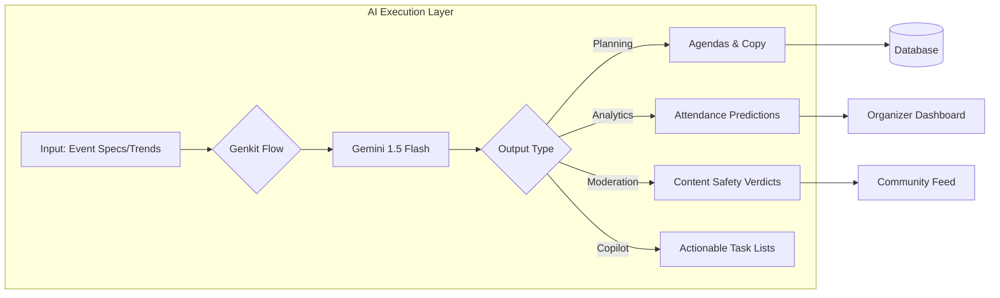
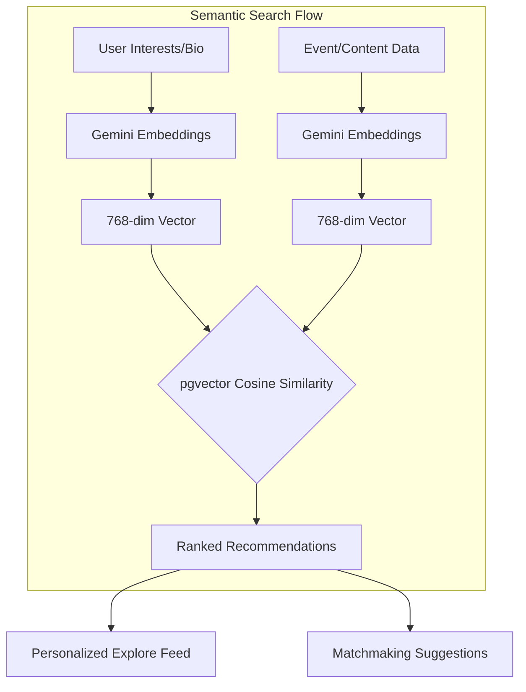
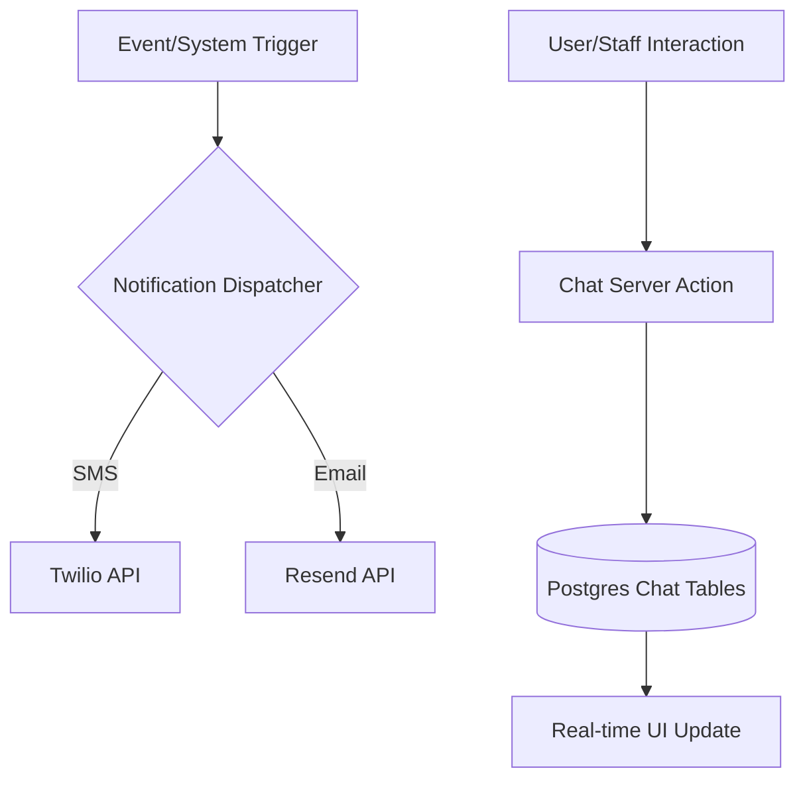
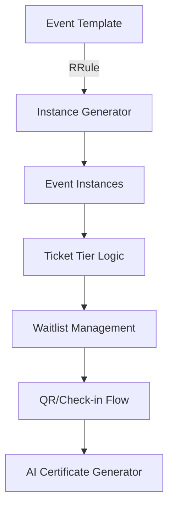
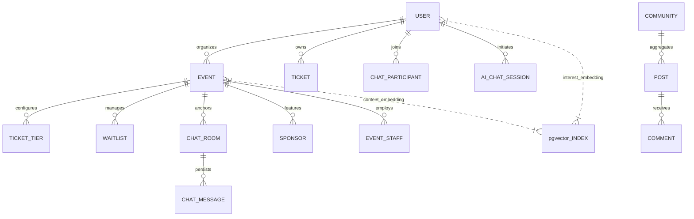

# Eventra — The Intelligent Event Management Ecosystem


Eventra is a premium, enterprise-grade event management platform designed to automate the full lifecycle of complex events. Built with **Next.js 15**, **PostgreSQL**, and **Google Gemini AI**, Eventra transforms passive event hosting into an active, data-driven, and community-centric experience.

---

## 🚀 Core Technology Pillars

### 1. **The Intelligence Engine (AI & Genkit)**
Powered by **Google Gemini 1.5 Flash** and **Genkit**, our AI layer provides real-time automation and deep insights.
- **Smart Event Planning**: Generates detailed descriptions, agendas, and marketing copy.
- **Predictive Analytics**: Estimates attendee turnout based on registration trends.
- **Automated Moderation**: Real-time sentiment analysis and content filtering.
- **Copilot for Organizers**: Generates actionable "To-Do" lists and smart scheduling suggestions.



---

### 2. **The Vector-Powered Recommendation Engine**
Eventra uses **pgvector** and semantic search to connect users with high-value content.
- **Semantic Matching**: Uses 768-dimensional vector embeddings to match user interests.
- **Connection Matchmaking**: Suggests networking based on professional goals.
- **Hyper-Personalization**: Delivers curated "Engagement Picks" that evolve with the user.



---

### 3. **The Real-Time Communication Hub**
A scalable chat and notification infrastructure built for high concurrency.
- **Contextual Channels**: Automatic event-specific chat rooms.
- **Direct & Group Messaging**: Private and professional networking.
- **Intelligent Notifications**: Multi-channel delivery (SMS via Twilio, Email via Resend).



---

### 4. **The Event Lifecycle Engine**
The core structural layer managing the complexities of modern events.
- **Dynamic Ticketing**: Multi-tier pricing, waitlists, and QR fulfillment.
- **Recurring Instances**: Advanced RRule-based scheduling.
- **Credential Management**: Automated PDF generation with AI-personalized messages.



---

## 🏗️ Master System Architecture

Eventra follows a **Feature-First modular architecture**, where AI and Vector engines are deeply integrated into the core mutation flows.

```mermaid
graph TD
    subgraph Frontend_Layer [Presentation]
        A[Next.js App Router] --> B[Server Components]
        A --> C[Client Components]
    end

    subgraph Service_Orchestration [Business Logic]
        B & C --> D[Server Actions]
        D --> E{Engine Router}
        E -->|AI Request| F[Intelligence Engine]
        E -->|Search/Match| G[Recommendation Engine]
        E -->|Comm| H[Communication Hub]
        E -->|Lifecycle| I[Lifecycle Engine]
    end

    subgraph Persistence_Layer [Data & External]
        F & G & H & I --> J[(Supabase Postgres + pgvector)]
        F --> K[Google Gemini API]
        H --> L[Twilio / Resend]
        I --> M[Stripe Payments]
    end

    style F fill:#7C3AED,stroke:#fff,color:#fff
    style G fill:#06B6D4,stroke:#fff,color:#fff
    style H fill:#10B981,stroke:#fff,color:#fff
    style I fill:#F59E0B,stroke:#fff,color:#fff
```



---

## 📊 Master Database Architecture (ERD)

The database handles relational, vector, and hierarchical data types.



---

## 🚦 Engineering Standards & Setup

### **1. Rapid Installation**
```bash
git clone <repository-url>
cd Eventra/eventra-webapp
npm install
cp .env.example .env.local
```

### **2. Local Deployment**
```bash
npm run db:push
npm run dev
```

---

## 📄 License

Copyright © 2026 **Eventra Ecosystem**. All rights reserved.

This project and its accompanying documentation are the proprietary and confidential property of **Eventra**. Any unauthorized use, reproduction, or distribution of this software, in whole or in part, without the prior written consent of the copyright holder is strictly prohibited.

### **Usage Restrictions**
- **Commercial Use**: Prohibited without a valid enterprise license.
- **Modification**: Modification of the core Intelligence Engine (Genkit flows) is restricted to certified contributors.
- **Redistribution**: Redistribution of the binary or source code is not permitted.

---
*Last Updated: June 14, 2026*
