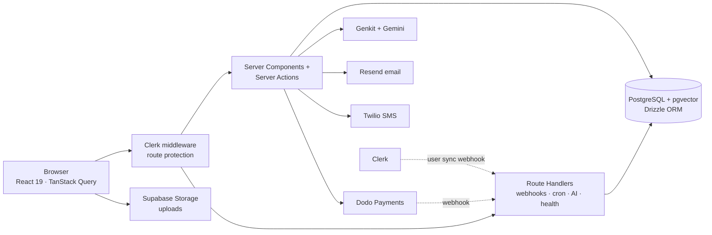
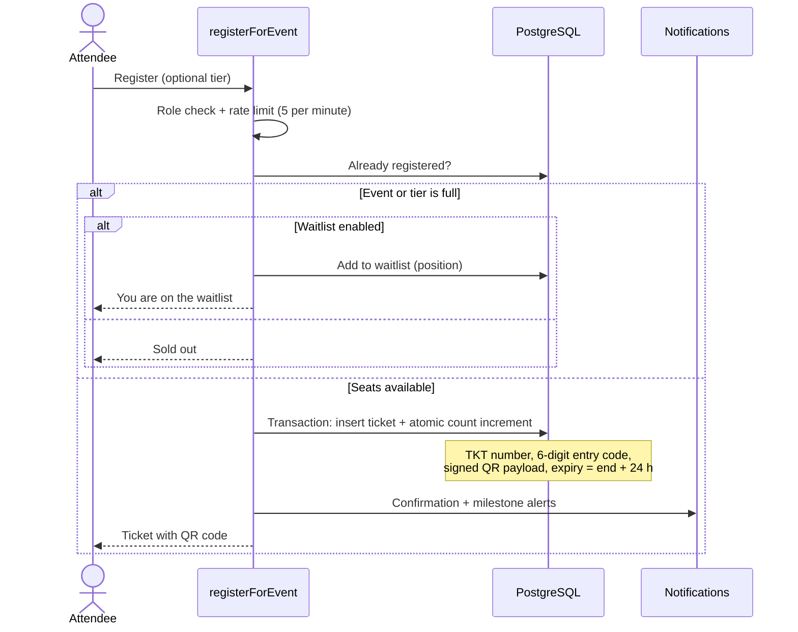
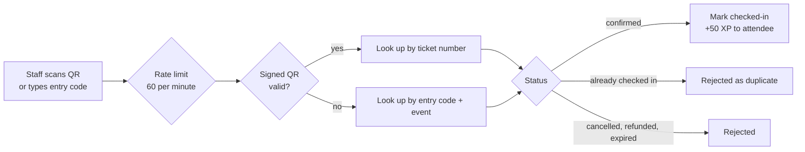
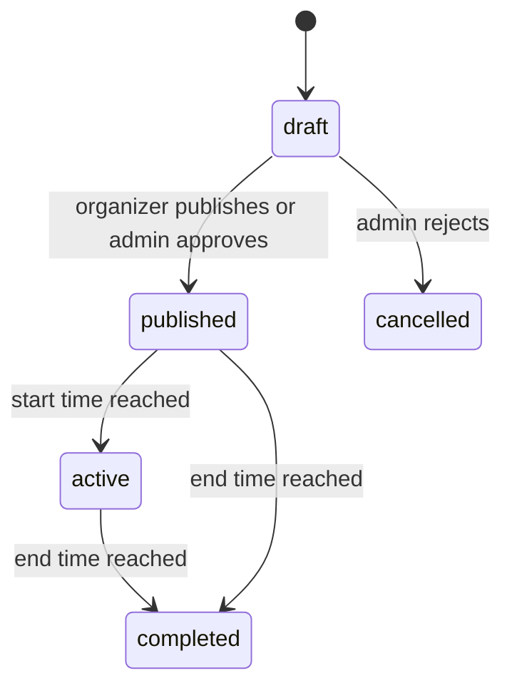
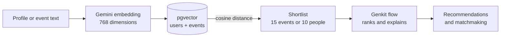

<div align="center">

# Eventra

### Intelligent event management, from first idea to post-event feedback

_Plan, sell tickets, check people in, and understand how it went, with AI where it helps._

[](LICENSE)
[](https://github.com/ArrinPaul/Eventra/actions/workflows/ci.yml)


[Quickstart](#quickstart) · [Features](#features) · [Architecture](#architecture) · [Methodology](./METHODOLOGY.md) · [Security](#security) · [Project status](#project-status) · [Report an issue](https://github.com/ArrinPaul/Eventra/issues)

</div>

---

## About

Eventra is a full-stack web platform for running events, with a focus on campus and community events. Organizers create events and sell or issue tickets. Attendees register, get QR tickets, find their way around a venue map, join communities and chat with other attendees. After the event, organizers collect feedback, hand out certificates and review analytics.

AI is built in where it saves effort: Google Gemini (through Genkit) drafts event content, plans tasks, answers attendee questions and writes reports, and vector embeddings in PostgreSQL power event and people recommendations. Every AI feature degrades gracefully when no API key is set.

**Who it's for:** event organizers and student clubs, attendees looking for events and people to meet, and platform admins who moderate content and users.

The project is under active development. See [Project status](#project-status) for what is finished, what is not wired up yet and what has not been tested against real services.

## Table of Contents

1. [About](#about)
2. [Features](#features)
3. [Architecture](#architecture)
4. [Core flows](#core-flows)
5. [Roles and permissions](#roles-and-permissions)
6. [Tech stack](#tech-stack)
7. [Quickstart](#quickstart)
8. [Configuration](#configuration)
9. [Data model](#data-model)
10. [Routes and server actions](#routes-and-server-actions)
11. [Security](#security)
12. [Testing](#testing)
13. [Scripts](#scripts)
14. [Project structure](#project-structure)
15. [Deployment](#deployment)
16. [Project status](#project-status)
17. [Troubleshooting](#troubleshooting)
18. [Documentation](#documentation)
19. [Contributing](#contributing)
20. [License](#license)

## Features

| Area | What it includes |
| :--- | :--- |
| **Events** | Creation wizard with AI help, categories and tags, recurring events (RRULE), sub-events, co-organizers, event cloning, public or private visibility, per-event branding, import of event metadata from a URL |
| **Ticketing** | Multiple ticket tiers with their own price and capacity, free registration, waitlist with 24-hour reserved spots, ticket expiry, QR codes plus 6-digit entry codes, calendar export |
| **Payments** | Dodo Payments checkout sessions and webhooks, refunds, promo codes, organizer payouts with a platform fee |
| **Check-in** | QR scanner, manual entry code, offline roster mode that syncs later, attendance scanner for organizers |
| **Venue maps** | Organizers upload a floor plan or map image, place nodes and draw walkable paths. Attendees get a route with turn-by-turn steps. A built-in campus map is the fallback. |
| **Agenda and live** | Agenda sessions and bookmarks, live stage view, event updates and announcements |
| **Community** | Communities and posts, activity feed, follows, event chat rooms, networking requests and one-to-one meetings |
| **AI** | Event content and agenda generation, task generation, attendance prediction, event Q&A chatbot, report generation, social post generator, content moderation, personalized recommendations, matchmaking |
| **Organizer tools** | Kanban task board, stakeholders, issue tracker, media gallery, sponsors and lead scanning, feedback templates, certificates with PDF export, printable badges, analytics, data export, collaboration view |
| **Feedback** | Post-event surveys, NPS and rating analytics, testimonials |
| **Gamification** | XP, levels, badges, challenges and a leaderboard |
| **Admin** | User and event moderation, platform settings, health endpoint |
| **Platform** | Role-based access (admin, organizer, attendee, student, professional, speaker, vendor and more), English and Spanish translations, installable PWA with an offline page |

## Architecture


```mermaid
flowchart LR
    B[Browser<br/>React 19 · TanStack Query] --> MW[Clerk middleware<br/>route protection]
    MW --> SC[Server Components +<br/>Server Actions]
    MW --> API[Route Handlers<br/>webhooks · cron · AI · health]
    SC --> DB[(PostgreSQL + pgvector<br/>Drizzle ORM)]
    API --> DB
    SC --> AI[Genkit + Gemini]
    SC --> RS[Resend email]
    SC --> TW[Twilio SMS]
    SC --> DP[Dodo Payments]
    DP -.->|webhook| API
    CL[Clerk] -.->|user sync webhook| API
    B --> SB[Supabase Storage<br/>uploads]
```

- **Server Actions** (`src/app/actions/`, 54 modules) hold most business logic. They validate input with Zod, check the caller's role and write through Drizzle.
- **Route Handlers** (`src/app/api/`, 23 routes) cover webhooks (Clerk, Dodo), the lifecycle cron, AI chat and prediction, ticket verification, exports and health checks.
- **Feature folders** (`src/features/`) hold the UI for each domain, and `src/core/` holds shared services such as email, crypto and certificate generation.
- **Rate limiting** is stored in the database, so it works across serverless instances.
- The algorithms are explained in [METHODOLOGY.md](./METHODOLOGY.md).

## Core flows

### Registration and ticketing


```mermaid
sequenceDiagram
    actor A as Attendee
    participant SA as registerForEvent
    participant DB as PostgreSQL
    participant N as Notifications

    A->>SA: Register (optional tier)
    SA->>SA: Role check + rate limit (5 per minute)
    SA->>DB: Already registered?
    alt Event or tier is full
        alt Waitlist enabled
            SA->>DB: Add to waitlist (position)
            SA-->>A: You are on the waitlist
        else
            SA-->>A: Sold out
        end
    else Seats available
        SA->>DB: Transaction: insert ticket + atomic count increment
        Note over DB: TKT number, 6-digit entry code,<br/>signed QR payload, expiry = end + 24 h
        SA->>N: Confirmation + milestone alerts
        SA-->>A: Ticket with QR code
    end
```

The paid path is implemented on the server but **not connected to any page yet**: `createCheckoutSession` prices the checkout from the chosen tier, Dodo Payments takes the payment, and a signature-verified webhook (`payment.completed`) creates the order and ticket with the same atomic capacity check. A `payment.refunded` webhook refunds the order and restores capacity. See [Project status](#project-status).

### Waitlist

When a ticket is cancelled, the next person in line (by position) gets a 24-hour reservation and a notification with a link to claim the spot. If the reservation expires, the next person is promoted. Details, including a capacity caveat, are in [METHODOLOGY.md](./METHODOLOGY.md#3-capacity-control-and-the-waitlist).

### Check-in


```mermaid
flowchart LR
    S[Staff scans QR<br/>or types entry code] --> RL{Rate limit<br/>60 per minute}
    RL --> P{Signed QR<br/>valid?}
    P -->|yes| T[Look up by ticket number]
    P -->|no| E[Look up by entry code + event]
    T --> C{Status}
    E --> C
    C -->|confirmed| OK[Mark checked-in<br/>+50 XP to attendee]
    C -->|already checked in| D[Rejected as duplicate]
    C -->|cancelled, refunded, expired| R[Rejected]
```

If the connection drops, the scanner can verify against a roster cached on the device and sync the scans later. Offline mode matches ticket numbers and codes but does not check the QR signature.

### Event lifecycle


```mermaid
stateDiagram-v2
    [*] --> draft
    draft --> published: organizer publishes or admin approves
    draft --> cancelled: admin rejects
    published --> active: start time reached
    active --> completed: end time reached
    published --> completed: end time reached
```

A scheduled job (`/api/cron/lifecycle`) performs the time-based transitions, sends post-event feedback emails and releases expired waitlist reservations. It must be called by an external scheduler. See [Deployment](#deployment).

### AI and recommendations


```mermaid
flowchart LR
    T[Profile or event text] --> EM[Gemini embedding<br/>768 dimensions]
    EM --> V[(pgvector<br/>users + events)]
    V -->|cosine distance| SH[Shortlist<br/>15 events or 10 people]
    SH --> LLM[Genkit flow<br/>ranks and explains]
    LLM --> UI[Recommendations<br/>and matchmaking]
```

Vector search builds the shortlist, and a Gemini flow writes the final ranking and the reasons. Without an API key or embeddings the app falls back to unranked lists. The other AI flows draft event content and agendas, generate organizer tasks and reports, summarize and moderate content, and predict attendance. Formulas and caveats are in [METHODOLOGY.md](./METHODOLOGY.md).

### Venue maps and location

Each event can have its own map: the organizer uploads an image (a floor plan or campus map), clicks to place named nodes (stage, booth, restroom, entrance, food and so on) and connects them with walkable paths. Attendees pick a start and destination and get a route with step-by-step directions, found by breadth-first search (fewest stops). Without a custom map, a built-in campus map with 11 predefined locations is used, and the app can combine a GPS fix with an AI guess to suggest where the user is.

### Communication

| Channel | How |
| :--- | :--- |
| Email (Resend) | 6 HTML templates: registration confirmation, ticket details, announcement, feedback request, thank-you and certificate ready |
| SMS (Twilio) | Optional text notifications |
| In-app and push | Notifications with read state, plus Web Push |
| Chat | Event chat rooms with direct and group messaging, and an AI event assistant |

## Roles and permissions

Access is checked at two levels.

**Platform role** (`users.role`, default `attendee`): `admin`, `organizer`, `attendee`, `student`, `professional`, `speaker` and `vendor`. The `/admin` pages require `admin` in the Clerk session, and server actions check the allowed roles for the operation.

**Event role** (`event_staff`): staff are added per event with a role (`volunteer`, `speaker`, `moderator` or `admin`) and a list of granular permissions.

| Who | Event access |
| :--- | :--- |
| Platform admin | Everything |
| Event organizer and co-organizers | Everything for their event |
| Event staff with role `admin` or `moderator` | Management access |
| Other staff | Only the permissions listed on their staff record |
| Everyone else | Public event pages and their own tickets |

Helpers in `src/lib/auth-utils.ts` enforce this: `requireAuth`, `validateRole`, `requireEventAccess`, `requireEventPermission`, `validateEventOwnership`, `validateStaffPermission`, `canAccessEventManagement` and `hasEventPermission`. If a signed-in Clerk user has no row in the database yet, it is created on first request with the `attendee` role.

## Tech stack

| Layer | Technology |
| :--- | :--- |
| Framework | Next.js 15 (App Router, Turbopack), React 19, TypeScript 5 |
| Auth | Clerk, with roles stored in session metadata and the `users` table |
| Database | PostgreSQL (Supabase) with the `pgvector` extension, Drizzle ORM and drizzle-kit |
| AI | Google Gemini 1.5 Flash through Genkit, `text-embedding-004` embeddings (768 dimensions) |
| Payments | Dodo Payments, verified with Svix webhook signatures |
| Messaging | Resend (email), Twilio (SMS), Web Push |
| UI | Tailwind CSS, Radix UI, shadcn/ui, Framer Motion, Recharts, Leaflet |
| Data and forms | TanStack Query, React Hook Form, Zod, rrule, date-fns |
| Documents | jsPDF and html2canvas (certificates), JSZip, PapaParse (exports), qrcode.react and html5-qrcode (tickets) |
| i18n | next-intl (English, Spanish) |
| Quality | Vitest, ESLint, TypeScript strict checks, GitHub Actions |

## Quickstart

Prerequisites: Node.js 20 or newer (CI uses 22), a PostgreSQL database that supports `pgvector` (a free [Supabase](https://supabase.com) project works), and a [Clerk](https://clerk.com) application.

```bash
git clone https://github.com/ArrinPaul/Eventra.git
cd Eventra
npm install

cp .env.example .env.local
# fill in Clerk, database, Supabase and secret values (see Configuration)

npm run env:check          # validates your .env.local
```

Enable the vector extension on your database and push the schema:

```sql
create extension if not exists vector;
```

```bash
npm run db:push            # create the tables
node scripts/run-seed-badges.mjs   # optional: seed the default badges
npm run dev                # http://localhost:9002
```

Create a Clerk webhook (`/api/webhooks/clerk`) pointing at your app and put its signing secret in `CLERK_WEBHOOK_SECRET`. The webhook keeps the `users` table in sync with Clerk. If it is missing, the app still creates a basic `attendee` row on a user's first request, but profile updates from Clerk will not arrive.

## Configuration

Copy `.env.example` to `.env.local` and never commit it. Values are validated by `src/lib/env.ts`.

**Always required**

| Variable | Purpose |
| :--- | :--- |
| `DATABASE_URL` | PostgreSQL connection string (use SSL for remote databases) |
| `NEXT_PUBLIC_SUPABASE_URL`, `NEXT_PUBLIC_SUPABASE_ANON_KEY` | Supabase project, used for file storage |
| `NEXT_PUBLIC_CLERK_PUBLISHABLE_KEY`, `CLERK_SECRET_KEY` | Clerk authentication |
| `NEXT_PUBLIC_DOMAIN`, `NEXT_PUBLIC_APP_URL` | App host and URL (default `localhost:9002`) |

**Required in production** (the app refuses to start or answers `500` without them)

| Variable | Purpose |
| :--- | :--- |
| `QR_SECRET` | At least 16 characters. Signs ticket QR codes. |
| `CLERK_WEBHOOK_SECRET` | Verifies Clerk user-sync webhooks |
| `DODO_PAYMENTS_WEBHOOK_SECRET` | Verifies payment webhooks |
| `CRON_SECRET` | Authorizes `/api/cron/lifecycle`. **Not in `.env.example`.** |
| `JWT_SECRET` (or `AUTH_SECRET` or `SESSION_SECRET`) | At least 16 characters, used by the session helper |

**Optional** (the matching feature is skipped when unset)

| Variable | Enables |
| :--- | :--- |
| `GOOGLE_API_KEY` (or `GEMINI_API_KEY`) | All AI features and embeddings |
| `DODO_PAYMENTS_API_KEY` | Payments |
| `RESEND_API_KEY` | Email |
| `TWILIO_ACCOUNT_SID`, `TWILIO_AUTH_TOKEN`, `TWILIO_FROM_NUMBER` | SMS |
| `DATABASE_POOLER_URL` | Supabase transaction pooler (falls back to `DATABASE_URL`) |
| `ALLOWED_ORIGINS` | CORS allow-list for `/api/*`. If unset, CORS headers are omitted. |
| `CSP_ENFORCE` | `false` switches the Content Security Policy back to report-only in production |

## Data model

Drizzle defines 46 tables in `src/lib/db/schema/index.ts`, and `drizzle/` holds 4 generated migrations. `users` and `events` each have a `vector(768)` embedding column. The diagram shows the main relationships, taken from the schema's foreign keys.


```mermaid
erDiagram
    users ||--o{ events : organizes
    users ||--o{ tickets : holds
    users ||--o{ waitlist : joins
    users ||--o{ orders : places
    users ||--o{ event_staff : "works as"
    users ||--o{ follows : "follows"
    users ||--o{ user_badges : earns
    users ||--o{ notifications : receives
    users ||--o{ posts : writes
    users ||--o{ chat_messages : sends

    events ||--o{ ticket_tiers : offers
    events ||--o{ tickets : issues
    events ||--o{ waitlist : queues
    events ||--o{ orders : "sold through"
    events ||--o{ event_staff : employs
    events ||--o{ promo_codes : accepts
    events ||--o{ agenda_sessions : schedules
    events ||--o{ event_feedback : collects
    events ||--o{ kanban_tasks : plans
    events ||--o{ issues : tracks
    events ||--o{ chat_rooms : hosts
    events ||--o{ event_sponsors : features
    events ||--o| event_maps : "has map"
    events ||--o{ event_tags : tagged

    ticket_tiers ||--o{ tickets : prices
    tags ||--o{ event_tags : labels
    event_maps ||--o{ event_map_nodes : contains
    agenda_sessions ||--o{ agenda_bookmarks : saved
    event_sponsors ||--o{ sponsor_leads : captures
    chat_rooms ||--o{ chat_participants : includes
    chat_rooms ||--o{ chat_messages : holds
    communities ||--o{ community_members : has
    communities ||--o{ posts : contains
    posts ||--o{ comments : receives
    badges ||--o{ user_badges : awarded
```

| Domain | Tables |
| :--- | :--- |
| Identity | `users`, `follows`, `notifications`, `activity_feed` |
| Events | `events`, `event_tags`, `tags`, `event_maps`, `event_map_nodes`, `event_media`, `event_updates`, `agenda_sessions`, `agenda_bookmarks`, `ingestion_sources` |
| Ticketing | `tickets`, `ticket_tiers`, `waitlist`, `orders`, `promo_codes`, `payouts` |
| Community | `communities`, `community_members`, `posts`, `comments`, `chat_rooms`, `chat_participants`, `chat_messages`, `networking_meetings` |
| Organizer | `event_staff`, `kanban_tasks`, `stakeholders`, `issues`, `reports`, `sponsors`, `event_sponsors`, `sponsor_leads` |
| Feedback and awards | `feedback_templates`, `event_feedback`, `feedback_responses`, `certificate_templates`, `badges`, `user_badges` |
| AI and platform | `ai_chat_sessions`, `ai_chat_messages`, `ai_recommendation_cache`, `rate_limits` |

## Routes and server actions

**Pages** are grouped under `src/app/(app)/` (signed in) and `src/app/(auth)/` (login, register, onboarding). The main areas are events, tickets, check-in, explore, feed, community, chat, networking, matchmaking, agenda, calendar, map, leaderboard, gamification, notifications, profile, settings, `organizer/*` and `admin`.

**API route handlers** (`src/app/api/`):

| Path | Purpose |
| :--- | :--- |
| `webhooks/clerk`, `webhooks/dodo` | Signature-verified webhooks for user sync and payments |
| `cron/lifecycle` | Automated event lifecycle sync, secured by `CRON_SECRET` |
| `tickets/verify` | Check-in verification by entry code |
| `ai/chat`, `predict`, `tasks/generate`, `reports` | AI chat, prediction, task and report generation |
| `certificates/{generate,preview,distribute}`, `attendees/export` | Certificates and exports |
| `feedback/{submit,responses}`, `issues`, `stakeholders`, `tasks` | Organizer data |
| `event-updates`, `event-gallery/[eventId]`, `notifications/push/subscribe`, `send-email` | Updates, media, push and email |
| `health` | Liveness check with database latency |

**Server actions** are in `src/app/actions/`, one module per domain (for example `events`, `registrations`, `payments`, `check-in`, `waitlist`, `gamification`, `matchmaking`, `ai-recommendations`).

## Security

Implemented in the code today:

- **Authentication.** Clerk middleware protects every route except a short public list. `/admin` also requires the `admin` role in session metadata.
- **Authorization.** Server actions check roles and event ownership or staff permissions before writing.
- **Webhooks.** Clerk and Dodo webhooks are verified with Svix signatures. In production a missing secret is a startup error, and the Dodo webhook also fails closed in every environment except an explicit local development run.
- **Tickets.** QR payloads are signed with HMAC-SHA256 and compared in constant time. Production refuses to run without `QR_SECRET`.
- **Race conditions.** Event and tier capacity use a single conditional `UPDATE`, so concurrent registrations cannot oversell.
- **Rate limiting.** A database-backed counter limits sensitive actions, for example 5 registrations per minute and 30 verification attempts per minute.
- **Headers.** HSTS, `X-Frame-Options: DENY`, `nosniff`, a referrer policy and a Content Security Policy, which is enforced in production by default.
- **Uploads.** Client uploads accept images only, up to 10 MB.
- **Environment.** Zod validates configuration, and the database connection throws in production if no URL is set.

Known gaps, so you can judge the risk:

- **The URL import tool has no server-side request guard.** `scrapeEventMetadata` (admin only) fetches any URL it is given, with no block on private or internal addresses.
- **Offline check-in does not verify signatures.** It matches a ticket number or entry code against the cached roster.
- **Entry codes are 6 digits.** Per-user rate limiting is the main defence.
- **The CSP still allows `unsafe-inline` and `unsafe-eval`** for scripts, which Next.js currently needs.
- **Dependency advisories.** `npm audit` reports 75 vulnerabilities in the production tree, rooted in a transitive `uuid` advisory through the Genkit and Google packages with no fix available (per `docs/AUDIT_REMEDIATION.md`).
- **Rate limiting is partial.** It is applied in about 26 files, and it keys on the `x-forwarded-for` header, so run behind a trusted proxy.

`AUDIT_REPORT.md` and `docs/AUDIT_REMEDIATION.md` record a September 2026 audit and which findings were fixed.

## Testing

```bash
npm test               # Vitest: 17 files, 86 tests
npm run typecheck      # tsc --noEmit
npm run lint           # next lint
```

The unit tests cover ticket signing, offline verification, promo-code maths, payout fees, map pathfinding, NPS analytics, calendar links, badge generation, sponsor and meeting helpers, the event lifecycle sync and environment validation. Server actions and API routes have little direct test coverage.

Smoke tests need a real database: `npm run test:smoke` seeds data, `npm run test:verify` checks the results and `npm run test:smoke:clean` removes it.

CI (`.github/workflows/ci.yml`) runs install, lint, typecheck, tests and a production build on every push and pull request to `main`, `master` and `develop`.

## Scripts

| Command | What it does |
| :--- | :--- |
| `npm run dev` | Dev server on port 9002 (Turbopack) |
| `npm run build` / `npm start` | Production build and server |
| `npm run lint`, `npm run typecheck` | ESLint and TypeScript checks |
| `npm test`, `npm run test:watch` | Vitest |
| `npm run env:check` | Validate environment variables |
| `npm run env:check:staging` | Validate and also test service connectivity |
| `npm run db:generate` | Generate a migration from schema changes |
| `npm run db:push` | Apply the schema directly to the database |
| `npm run db:studio` | Drizzle Studio |
| `npm run test:smoke`, `test:smoke:clean`, `test:verify` | Smoke test data and checklist |

`scripts/` also holds one-off diagnostic and maintenance scripts (database checks, realtime setup, badge seeding, the scraper runner). Read a script before running it against a real database.

## Project structure

```text
Eventra/
├── src/
│   ├── app/              Pages ((app), (auth)), api/ route handlers, actions/ server actions
│   ├── features/         UI and logic by domain (events, ticketing, map, chat, organizer, ...)
│   ├── core/             Services (email, SEO, push), utils (crypto, payouts, NPS, promo codes)
│   ├── components/       Shared UI, layout and shadcn/ui primitives
│   ├── lib/              Database and schema, AI (Genkit), rate limiting, env validation, GPS
│   ├── hooks/, i18n/, types/
│   └── middleware.ts     Clerk route protection
├── drizzle/              Generated SQL migrations
├── messages/             Translations (en, es)
├── scripts/              Env checks, seeding, smoke tests, diagnostics
├── public/               PWA manifest, service worker, README images
├── docs/AUDIT_REMEDIATION.md   Fixes applied after the audit
├── AUDIT_REPORT.md       Production readiness audit
├── METHODOLOGY.md        Algorithms and formulas
└── LICENSE               MIT License
```

## Deployment

Eventra is a standard Next.js app and needs Node.js hosting, a PostgreSQL database with `pgvector`, and Clerk. The repo has no platform-specific deployment config.

1. Set every production variable from [Configuration](#configuration).
2. Run `npm run env:check:staging` to validate values and connectivity.
3. Run `npm run db:push` against the production database.
4. Run `npm run build`, deploy, and check that `/api/health` returns `200`.
5. **Schedule the lifecycle job.** Call `GET` or `POST /api/cron/lifecycle` regularly (for example every 5 to 15 minutes) with `Authorization: Bearer <CRON_SECRET>`. The repo contains no scheduler, so without this events never move from published to active to completed, feedback emails are not sent and expired waitlist reservations are not released.
6. Register the Clerk and Dodo webhook URLs with your production domain.

## Project status

The code type-checks and its 86 unit tests pass, and CI runs lint and a build. These parts are unfinished or unproven:

- **Paid checkout is not wired into the UI.** `createCheckoutSession` exists and is covered by the server logic, but no page calls it, so the Register button always uses free registration. Promo codes are also only a client-side discount preview, not applied to what is charged.
- **Waitlist claims can oversell.** A reserved spot does not hold a seat, and the claim step skips the capacity check that normal registration uses. Details in [METHODOLOGY.md](./METHODOLOGY.md#3-capacity-control-and-the-waitlist).
- **Recommendation caching is dead code.** The `ai_recommendation_cache` table and its helpers exist, but nothing reads or writes them, so every recommendation call re-runs the vector query and the AI flow.
- **The lifecycle cron needs an external scheduler** (see [Deployment](#deployment)).
- **There is no "archived" state.** Events end at `completed`.
- **Email, SMS, Gemini, Dodo and Clerk integrations** are not exercised by automated tests, so they need manual checks with real credentials.
- **The 6-digit entry code** is a deliberate usability trade-off that the audit deferred.
- **Housekeeping.** Two generated test artifacts, `.smoke-last-run.json` and `.phase3-manual-verify.md`, are committed to the repo root.

## Troubleshooting

| Symptom | Likely cause | Fix |
| :--- | :--- | :--- |
| App fails at start with "Invalid server environment variables" | A required variable is missing or too short | Run `npm run env:check` and fix what it lists. |
| Production start throws about `QR_SECRET`, `CRON_SECRET` or webhook secrets | They are required when `NODE_ENV=production` | Set them. `CRON_SECRET` is not in `.env.example`. |
| `db:push` fails on a `vector` type | The `pgvector` extension is not enabled | Run `create extension if not exists vector;` as a database admin. |
| Name, photo or role changes in Clerk do not appear in the app | The Clerk webhook is not reaching the app | Point a Clerk webhook at `/api/webhooks/clerk` and set `CLERK_WEBHOOK_SECRET`. |
| AI features return nothing | No `GOOGLE_API_KEY` or `GEMINI_API_KEY`, a timeout (15 s) or quota | Set the key. Check the server log for the `[AI:...]` warning. |
| Events never become active or completed | Nothing calls the lifecycle cron | Schedule `/api/cron/lifecycle` with `CRON_SECRET`. |
| Image upload fails | File is not an image, over 10 MB, or the `eventra-uploads` bucket is missing | Check the file and create the Supabase storage bucket. |
| `Too many requests` errors | The database rate limiter | Wait a minute. Limits are per user and IP. |
| `npm ci` complains about peer dependencies | Peer ranges conflict | CI installs with `npm ci --force`. |
| CORS errors from another origin | `ALLOWED_ORIGINS` is not set | Set it to the allowed origins. |

## Documentation

| Document | Purpose |
| :--- | :--- |
| [`METHODOLOGY.md`](METHODOLOGY.md) | Algorithms: ticket signing, capacity and waitlist, recommendations, hybrid location, XP and NPS |
| [`AUDIT_REPORT.md`](AUDIT_REPORT.md) | Production readiness audit and findings |
| [`docs/AUDIT_REMEDIATION.md`](docs/AUDIT_REMEDIATION.md) | What was fixed, deferred or left open |

## Contributing

Issues and pull requests are welcome. Run `npm run lint`, `npm run typecheck`, `npm test` and `npm run build` before opening a PR, which are the same checks CI runs. Keep secrets out of commits, and never commit `.env` files.

## License

Released under the MIT License. See [LICENSE](LICENSE).
