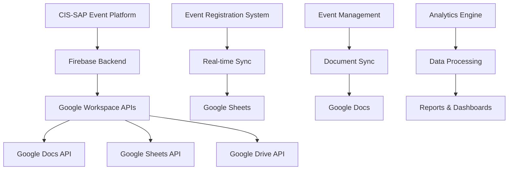
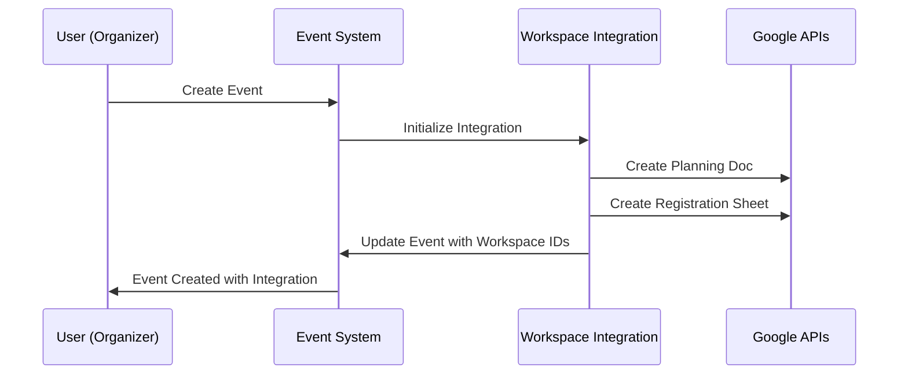
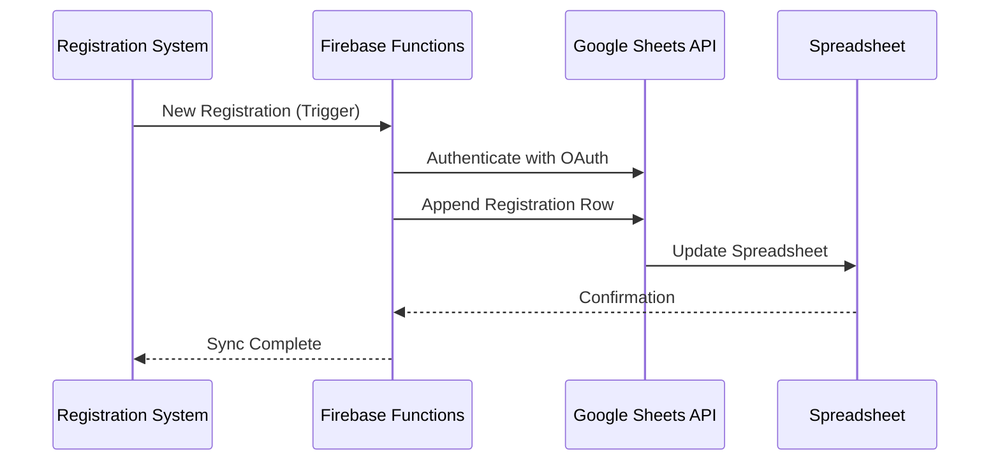

# Google Workspace Integration Documentation

## Overview

The CIS-SAP Event Management Platform integrates seamlessly with Google Workspace to provide comprehensive document collaboration and data management capabilities. This integration connects three core systems:

1. **Event Organizer System A** - Core event management and registration system
2. **Google Docs Integration** - Collaborative document creation and editing
3. **Google Sheets Integration** - Real-time data analytics and reporting

## Table of Contents

- [Architecture Overview](#architecture-overview)
- [Features](#features)
- [Setup & Configuration](#setup--configuration)
- [User Roles & Permissions](#user-roles--permissions)
- [API Reference](#api-reference)
- [Integration Workflows](#integration-workflows)
- [Troubleshooting](#troubleshooting)
- [Security Considerations](#security-considerations)

## Architecture Overview



### Key Components

- **Firebase Cloud Functions**: Backend API layer handling Google Workspace operations
- **Integration Service**: Client-side service managing three-system synchronization
- **Permissions Service**: Role-based access control for workspace features
- **Real-time Sync Engine**: Automatic data synchronization between systems

## Features

### 📄 Google Docs Integration

- **Document Templates**: Pre-built templates for event planning, agendas, notes, and feedback
- **Real-time Collaboration**: Multiple users can edit documents simultaneously
- **Auto-sync**: Event details automatically update in planning documents
- **Permission Control**: Role-based document access and editing permissions

#### Supported Document Types

| Template Type | Description | Access Level |
|---------------|-------------|--------------|
| Event Planning | Comprehensive planning checklist and timeline | Organizers, Professionals |
| Agenda | Detailed event schedule and session information | All roles |
| Meeting Notes | Collaborative note-taking during events | All roles |
| Feedback Collection | Post-event feedback and evaluation forms | Organizers only |

### 📊 Google Sheets Integration

- **Registration Tracking**: Automatic population of registration data
- **Analytics Dashboard**: Real-time attendance metrics and insights
- **Custom Reports**: Flexible reporting with custom data views
- **Auto-sync**: Registration changes instantly reflect in spreadsheets

#### Supported Spreadsheet Types

| Template Type | Description | Auto-sync | Access Level |
|---------------|-------------|-----------|--------------|
| Registrations | Real-time registration and check-in tracking | ✅ | Organizers only |
| Analytics | Attendance metrics and engagement data | ✅ | Organizers only |
| Feedback Analysis | Survey responses and satisfaction metrics | ❌ | Organizers only |
| Event Planning | Budget tracking and vendor management | ❌ | Organizers, Professionals |

### 🔄 Real-time Synchronization

- **Bidirectional Sync**: Changes in either system reflect in the other
- **Conflict Resolution**: Automatic handling of simultaneous edits
- **Offline Support**: Changes sync when connection is restored
- **Error Recovery**: Robust error handling with retry mechanisms

## Setup & Configuration

### Prerequisites

1. **Firebase Project**: Configured with Cloud Functions and Firestore
2. **Google Cloud Project**: With APIs enabled for Docs, Sheets, and Drive
3. **OAuth 2.0 Credentials**: For Google Workspace authentication
4. **Domain Verification**: For production deployment

### Environment Variables

```bash
# Firebase Functions Configuration
GOOGLE_WORKSPACE_CLIENT_ID=your_client_id
GOOGLE_WORKSPACE_CLIENT_SECRET=your_client_secret  
GOOGLE_WORKSPACE_REDIRECT_URI=https://yourapp.com/auth/callback

# Firebase Configuration (frontend)
NEXT_PUBLIC_FIREBASE_API_KEY=your_api_key
NEXT_PUBLIC_FIREBASE_AUTH_DOMAIN=your_auth_domain
NEXT_PUBLIC_FIREBASE_PROJECT_ID=your_project_id
```

### Installation Steps

1. **Clone and Install Dependencies**
   ```bash
   git clone https://github.com/your-org/cis-sap-platform
   cd cis-sap-platform
   npm install
   cd functions && npm install
   ```

2. **Configure Google Cloud APIs**
   ```bash
   # Enable required APIs
   gcloud services enable docs.googleapis.com
   gcloud services enable sheets.googleapis.com
   gcloud services enable drive.googleapis.com
   ```

3. **Set Up OAuth Credentials**
   - Go to Google Cloud Console
   - Create OAuth 2.0 credentials
   - Add authorized redirect URIs
   - Download credentials JSON

4. **Deploy Firebase Functions**
   ```bash
   firebase deploy --only functions
   ```

5. **Configure Frontend Environment**
   ```bash
   cp .env.example .env.local
   # Edit .env.local with your configuration
   ```

6. **Start Development Server**
   ```bash
   npm run dev
   ```

## User Roles & Permissions

### Role Matrix

| Feature | Student | Professional | Organizer |
|---------|---------|--------------|-----------|
| Connect Google Workspace | ❌ | ✅ | ✅ |
| View Documents | ✅* | ✅ | ✅ |
| Create Planning Docs | ❌ | ✅ | ✅ |
| Create Feedback Docs | ❌ | ❌ | ✅ |
| View Registration Sheets | ❌ | ❌ | ✅ |
| Sync Registration Data | ❌ | ❌ | ✅ |
| Manage Integration Settings | ❌ | ❌ | ✅ |

*Students can only view shared documents and meeting notes

### Permission Implementation

```typescript
// Example permission check
import { permissionsService } from '../lib/permissions-service';

const canCreateDocument = permissionsService.canCreateDocument(
  user, 
  event, 
  'event_planning'
);

if (!canCreateDocument) {
  throw new Error('Insufficient permissions');
}
```

## API Reference

### Cloud Functions

#### Authentication Functions

##### `getGoogleWorkspaceAuthUrl`
Generates OAuth URL for Google Workspace connection.

```typescript
// Call from client
const { data } = await httpsCallable(functions, 'getGoogleWorkspaceAuthUrl')({});
window.open(data.authUrl, 'googleAuth', 'width=600,height=600');
```

**Response:**
```typescript
{
  authUrl: string;
}
```

##### `handleGoogleWorkspaceCallback`
Processes OAuth callback and stores tokens.

```typescript
const { data } = await httpsCallable(functions, 'handleGoogleWorkspaceCallback')({
  code: 'auth_code',
  state: 'user_id'
});
```

**Response:**
```typescript
{
  success: boolean;
  message: string;
}
```

#### Document Functions

##### `createEventDocument`
Creates a new Google Doc from template.

```typescript
const { data } = await httpsCallable(functions, 'createEventDocument')({
  eventId: 'event-123',
  template: {
    templateType: 'event_planning',
    title: 'My Event Planning Doc',
    content: 'Custom content...'
  }
});
```

**Response:**
```typescript
{
  success: boolean;
  documentId: string;
  documentUrl: string;
  message: string;
}
```

#### Spreadsheet Functions

##### `createEventSpreadsheet`
Creates a new Google Sheet from template.

```typescript
const { data } = await httpsCallable(functions, 'createEventSpreadsheet')({
  eventId: 'event-123',
  template: {
    templateType: 'registrations',
    title: 'Event Registrations',
    sheets: [
      {
        title: 'Registrations',
        headers: ['Name', 'Email', 'Role', 'Status']
      }
    ]
  }
});
```

##### `syncRegistrationsToSheet`
Syncs registration data to Google Sheets.

```typescript
const { data } = await httpsCallable(functions, 'syncRegistrationsToSheet')({
  eventId: 'event-123'
});
```

**Response:**
```typescript
{
  success: boolean;
  syncedRecords: number;
  message: string;
}
```

### Integration Service API

#### `integrationService.initializeEventIntegration()`
Sets up complete integration for an event.

```typescript
import { integrationService } from '../lib/integration-service';

const result = await integrationService.initializeEventIntegration('event-123', {
  createPlanningDoc: true,
  createRegistrationSheet: true,
  enableAutoSync: true
});
```

#### `integrationService.onRegistrationUpdate()`
Sets up real-time registration monitoring.

```typescript
const unsubscribe = integrationService.onRegistrationUpdate('event-123', (registrations) => {
  console.log('New registrations:', registrations);
});

// Clean up listener
unsubscribe();
```

## Integration Workflows

### Event Creation Workflow



### Registration Sync Workflow



### Real-time Updates

```typescript
// Set up real-time listeners
useEffect(() => {
  const unsubscribeRegistrations = integrationService.onRegistrationUpdate(
    eventId,
    (registrations) => {
      setRegistrationData(registrations);
    }
  );
  
  const unsubscribeSync = integrationService.getSyncStatus(
    eventId,
    (status) => {
      setSyncStatus(status);
    }
  );

  return () => {
    unsubscribeRegistrations();
    unsubscribeSync();
  };
}, [eventId]);
```

## Error Handling

### Common Error Scenarios

#### Authentication Errors
```typescript
try {
  await createEventDocument(eventId, template);
} catch (error) {
  if (error.code === 'unauthenticated') {
    // Redirect to re-authenticate
    redirectToAuth();
  } else if (error.code === 'failed-precondition') {
    // Google Workspace not connected
    showConnectWorkspaceDialog();
  }
}
```

#### Rate Limiting
```typescript
const syncWithRetry = async (eventId, maxRetries = 3) => {
  for (let attempt = 1; attempt <= maxRetries; attempt++) {
    try {
      return await integrationService.syncRegistrationData(eventId);
    } catch (error) {
      if (error.message.includes('rate limit') && attempt < maxRetries) {
        // Exponential backoff
        await new Promise(resolve => setTimeout(resolve, Math.pow(2, attempt) * 1000));
        continue;
      }
      throw error;
    }
  }
};
```

#### Network Failures
```typescript
const handleNetworkError = (error) => {
  if (error.message.includes('network')) {
    toast({
      title: "Connection Error",
      description: "Please check your internet connection and try again.",
      variant: "destructive",
    });
  }
};
```

## Security Considerations

### OAuth Token Management
- Tokens are encrypted and stored securely in Firestore
- Automatic token refresh prevents expiration issues
- Tokens are scoped to minimum required permissions

### Data Privacy
- User consent required before Google Workspace connection
- Data processing complies with GDPR requirements
- Audit logs track all integration activities

### Access Control
- Role-based permissions prevent unauthorized access
- Event ownership validation for sensitive operations
- API rate limiting prevents abuse

### Best Practices

1. **Token Security**
   ```typescript
   // Never expose tokens in client-side code
   // Always validate tokens on server side
   const isValidToken = await validateGoogleToken(accessToken);
   ```

2. **Error Logging**
   ```typescript
   // Log errors without exposing sensitive data
   console.error('Sync failed for event:', eventId, {
     error: error.message,
     timestamp: new Date().toISOString()
   });
   ```

3. **Rate Limiting**
   ```typescript
   // Implement exponential backoff
   const delay = Math.min(1000 * Math.pow(2, retryCount), 30000);
   await new Promise(resolve => setTimeout(resolve, delay));
   ```

## Troubleshooting

### Common Issues

#### "Google Workspace not connected"
- **Cause**: OAuth tokens expired or invalid
- **Solution**: Re-authenticate through settings panel

#### "Permission denied for document creation"
- **Cause**: User role lacks required permissions
- **Solution**: Contact event organizer or upgrade account

#### "Sync failed with network error"
- **Cause**: Internet connectivity or API rate limits
- **Solution**: Check connection and retry after delay

#### "Document not found"
- **Cause**: Document deleted or access revoked
- **Solution**: Recreate document from template

### Debug Mode

Enable detailed logging:

```typescript
// Enable debug mode
localStorage.setItem('debug-integration', 'true');

// Check sync status
const status = await integrationService.getSyncStatus(eventId);
console.log('Debug - Sync Status:', status);
```

### Support Contacts

- **Technical Issues**: support@cis-sap.org
- **Integration Help**: integrations@cis-sap.org
- **Security Concerns**: security@cis-sap.org

## Performance Optimization

### Batch Operations
```typescript
// Batch multiple registration syncs
const batchSync = async (eventIds) => {
  const results = await Promise.allSettled(
    eventIds.map(id => integrationService.syncRegistrationData(id))
  );
  return results;
};
```

### Caching Strategy
```typescript
// Cache workspace items to reduce API calls
const cachedItems = useMemo(() => {
  return integrationService.getEventWorkspaceItems(eventId);
}, [eventId, lastSyncTime]);
```

### Connection Pooling
- Reuse OAuth client instances
- Implement connection pooling for Firebase
- Use CDN for static assets

## Deployment Guide

### Production Checklist

- [ ] Environment variables configured
- [ ] Google Cloud APIs enabled and quota set
- [ ] OAuth credentials created with production URLs
- [ ] Firebase security rules updated
- [ ] SSL certificates installed
- [ ] Monitoring and alerting configured
- [ ] Backup procedures tested

### Monitoring

```typescript
// Set up performance monitoring
const performanceMonitor = {
  trackSync: (eventId, startTime) => {
    const duration = Date.now() - startTime;
    analytics.track('workspace_sync', {
      eventId,
      duration,
      success: true
    });
  }
};
```

---

## Changelog

### v1.0.0 (Current)
- Initial Google Workspace integration
- Document and spreadsheet templates
- Real-time synchronization
- Role-based permissions
- Comprehensive error handling

### Roadmap

- **v1.1.0**: Enhanced analytics and reporting
- **v1.2.0**: Mobile app integration
- **v1.3.0**: Advanced collaboration features
- **v2.0.0**: AI-powered insights and automation

---

*For additional support or feature requests, please contact our integration team at integrations@cis-sap.org*